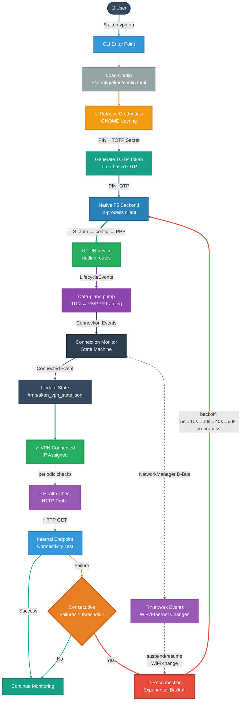

  <div align="center">
    
  </div>
  <div align="center">
    
    
    
    
  </div>

# akon - OTP VPN Tool

A CLI for managing VPN connections with automatic TOTP (Time-based One-Time Password) authentication using high performance code and security best practices.

## Features

- **Native F5 VPN client**: a pure-Rust, in-process F5 BIG-IP SSL VPN
  implementation (PPP-over-HTTPS). **No `openconnect`, no `sudo`-spawned child.**
- **Rootless**: runs as your user (keyring intact); the only privilege needed is
  `CAP_NET_ADMIN` for the TUN device + route setup, granted via a file capability
  (`setcap cap_net_admin+ep`). TUN/address/route configuration is done in-process
  via **netlink**.
- **Secure Credential Management**: Stores PIN and TOTP secret securely in GNOME Keyring
- **Automatic OTP Generation**: Generates TOTP tokens automatically during connection
- **Automatic Reconnection**: Detects network interruptions and reconnects with exponential backoff (supervised in-process)
- **Guaranteed host restore**: `akon vpn off` reconciles every networking change
  (tun, routes, rp_filter, DNS) from a persisted plan — even after a crash.
- **Health Monitoring**: Periodic health checks detect silent VPN failures
- **Fast & Lightweight**: written in Rust, dependency-light (no external VPN binary)

## Table of Contents

- [Requirements](#requirements)
- [Installation](#installation)
- [Quick Start](#quick-start)
- [Configuration](#configuration)
- [Why "akon"?](#why-akon)
- [Architecture](#architecture)
- [Contributing](#contributing)
- [License](#license)

## Requirements

- **Operating System**: Linux (tested on Ubuntu/Debian, RHEL/Fedora). The VPN
  data plane is Linux-only (TUN + netlink).
- **`CAP_NET_ADMIN`**: needed to create the TUN device and configure routes.
  Granted once as a **file capability** on the binary (no sudo at runtime):

  ```bash
  sudo setcap cap_net_admin+ep "$(command -v akon)"
  # Requires libcap's setcap:
  #   Ubuntu/Debian: sudo apt install libcap2-bin
  #   RHEL/Fedora:   sudo dnf install libcap
  ```

  > Note: file capabilities do not elevate inside a user namespace
  > (rootless-container dev environments) — those still need `sudo`/`--cap-add
  > NET_ADMIN`. Normal bare-metal hosts get true rootless operation.

- **GNOME Keyring**: For secure credential storage

  ```bash
  sudo apt install gnome-keyring libsecret-1-dev
  ```

- **No `openconnect`**: akon is a self-contained native client and does **not**
  use or require the `openconnect` binary.

## Installation

### Binary Packages (Recommended)

Download pre-built packages for your distribution from the [GitHub Releases](https://github.com/vcwild/akon/releases) page.

#### Ubuntu/Debian

```bash
# Install the package
sudo dpkg -i akon_latest_amd64.deb

# If there are dependency issues, run:
sudo apt-get install -f
```

#### Fedora/RHEL

```bash
# Install the package
sudo dnf install ./akon-latest-1.x86_64.rpm
```

### From Source

```bash
# Clone the repository
git clone https://github.com/vcwild/akon.git
cd akon

# Build and install (grants the CAP_NET_ADMIN file capability)
make install

# Verify installation
akon --help
```

**What `make install` does:**

- Builds the release binary
- Installs to `/usr/local/bin/akon`
- Grants `cap_net_admin+ep` on the binary (so akon runs rootless, as your user)
- Removes any legacy passwordless-sudo config from older akon versions

## Quick Start

### 1. Setup Credentials

Store your VPN credentials securely:

```bash
akon setup
```

You'll be prompted for:

- **Server**: VPN server hostname (e.g., `vpn.example.com`)
- **Username**: Your VPN username
- **PIN**: Your numeric PIN
- **TOTP Secret**: Your TOTP secret key (Base32 encoded)

These credentials are stored in:

- Config file: `~/.config/akon/config.toml` (server, username, protocol)
- Keyring: GNOME Keyring (PIN and TOTP secret - encrypted)

### 2. Connect to VPN

```bash
akon vpn on
```

**What happens (all in-process — `akon` *is* the VPN client):**

1. Loads config from `~/.config/akon/config.toml`
2. Retrieves PIN and TOTP secret from keyring
3. Generates current TOTP token
4. Connects natively over TLS (auth → config → PPP), configures the TUN device
   and routes via netlink
5. Carries the data plane and supervises health/reconnection in-process
6. Reports IP address when connected (stays running until Ctrl-C or `akon vpn off`)

### 3. Check Status

```bash
akon vpn status
```

**Outputs:**

- **Connected** (exit code 0): Shows IP, device, duration, PID
- **Not connected** (exit code 1): No active connection
- **Stale state** (exit code 2): Process died, cleanup needed

### 4. Disconnect

```bash
akon vpn off
```

**Disconnect flow:**

1. Signals the running akon VPN process to stop (it drops the TUN and reverts in-process)
2. Replays the persisted host-teardown plan to reconcile the host (removes the
   tun, the VPN-server pin route, restores `rp_filter`, reverts DNS) — idempotent
   and works even if the process was already killed
3. Cleans up state file

### 5. Manual OTP Generation

Generate OTP token for manual use:

```bash
akon get-password
```

Outputs PIN+TOTP combined password (does not initiate connection).

## Configuration

### Config File Location

`~/.config/akon/config.toml`

### Example Configuration

```toml
[vpn]
server = "vpn.example.com"
username = "your.username"
protocol = "f5"  # F5 SSL VPN protocol

# Optional settings
timeout = 60
no_dtls = false
lazy_mode = true  # Connect VPN when running 'akon' without arguments
```

### Lazy Mode

When `lazy_mode = true` is set in your configuration, running `akon` without any arguments will automatically connect to the VPN:

```bash
# With lazy mode enabled, these are equivalent:
akon
akon vpn on

# With lazy mode disabled, akon without args shows help
akon  # Shows usage information
```

This feature is perfect for quick VPN connections - just type `akon` and go!

### Native F5 backend (the only backend)

akon is a **native, in-process F5 BIG-IP SSL VPN client** — there is no
`openconnect` and no `native_backend` flag (the native path is always used for
`protocol = "f5"`). It performs the full handshake over TLS
(auth → XML config → `/myvpn` tunnel upgrade → PPP LCP/IPCP), configures the TUN
device and routes **in-process via netlink**, applies DNS on `systemd-resolved`
systems (Fedora/Ubuntu, with `resolvconf`/`resolv.conf` fallbacks), and
supervises health/reconnection in-process (honoring the `[reconnection]`
settings). It runs as your user with a `cap_net_admin+ep` file capability — no
`sudo`. It is Linux-only.

> Migrating from an older akon? Drop any `native_backend = ...` line from your
> config (it is ignored now), ensure the binary has the capability
> (`sudo setcap cap_net_admin+ep "$(command -v akon)"`, or just re-run
> `make install`), and stop installing `openconnect`.

#### Verifying against your own server (production sign-off)

A deliberate, opt-in sign-off test (`tests/production_signoff_test.rs`) connects
the native backend to **your own** configured F5 server using **your** local
config and keyring credentials, reaches `Connected`, and disconnects
immediately. No server, username, or network is hardcoded in akon — it reads
everything from `~/.config/akon/config.toml` and the keyring at run time. It
creates no TUN device and changes no routes/DNS, so it does not disrupt your
connectivity. It is disabled by default and requires an explicit double opt-in:

```bash
AKON_SIGNOFF_PRODUCTION=1 \
AKON_SIGNOFF_ACK=I_UNDERSTAND_THIS_HITS_PRODUCTION \
cargo test --test production_signoff_test -- --nocapture
```

The control-plane sign-off above has been validated against a real production F5
appliance (authenticated with PIN+OTP, completed the full handshake + PPP to
network-up, assigned a tunnel IP, disconnected cleanly).

#### Data-plane sign-off (proves traffic actually flows)

A second, deeper gate (`tests/production_dataplane_signoff_test.rs`) opens a
**real TUN device**, connects to your appliance, then routes **one** target you
specify (`AKON_SOAK_PROBE_TARGET`, a host reachable only via the VPN) through the
tunnel as a `/32` route and verifies it becomes reachable — proving user traffic
traverses the native data plane. It **never installs a default route** (so it
cannot hijack your connectivity), removes the route and tears down the TUN on
every exit (including failures), and is bounded. It needs root (`CAP_NET_ADMIN`)
and is triple-gated:

Use the helper, which builds as your user, generates the PIN+OTP as your user
(`akon get-password`), then runs the test binary, passing the password via
`AKON_SOAK_PASSWORD` (never printed):

```bash
AKON_SOAK_PROBE_TARGET=intranet.example.com ./test-support/run-dataplane-signoff.sh
```

> Rootless runtime is fully implemented: with `setcap cap_net_admin+ep` on the
> binary, akon configures the TUN and routes in-process via netlink as your user
> — no `sudo`. The containerized proof is `test-support/run-rootless-validation.sh`
> (runs the data plane as a non-root user inside a container). The soak still
> uses elevation only where your environment requires it for `/dev/net/tun`.

The probe target may be **VPN-only**: if its name doesn't resolve before the
tunnel is up, the soak routes the negotiated VPN DNS server through the tunnel
and resolves the name **through the tunnel** (which itself proves the data plane
carries traffic). You can also pass an **IP literal**
(`AKON_SOAK_PROBE_TARGET=10.10.x.y:443`) to skip DNS entirely. The whole soak is
bounded by a hard 30s deadline and tears down the TUN + all routes on every exit.

The probe target accepts a bare host, `host:port`, or a full URL (port defaults
to 443). Equivalent manual form (build first, then sudo the binary):

```bash
BIN=$(cargo test --test production_dataplane_signoff_test --no-run \
  --message-format=json | sed -n 's/.*"executable":"\([^"]*production_dataplane_signoff_test[^"]*\)".*/\1/p' | tail -1)
sudo -E AKON_F5_DEBUG=1 \
  AKON_SIGNOFF_PRODUCTION=1 \
  AKON_SIGNOFF_ACK=I_UNDERSTAND_THIS_HITS_PRODUCTION \
  AKON_SOAK_PROBE_TARGET=intranet.example.com \
  "$BIN" --nocapture
```

The route/teardown mechanics are rehearsed locally on a real TUN by the gated
test `native_f5_real_tun_tests` (`sudo -E AKON_RUN_TUN_TESTS=1 cargo test
-p akon-core --features test-actors --test native_f5_real_tun_tests`), so the
production run only adds the live appliance.

### Automatic Reconnection

akon automatically detects network interruptions and reconnects your VPN with intelligent retry logic.

#### Additional configuration for reconnection

Add a `[reconnection]` section to your config to enable automatic reconnection:

```toml
[vpn]
server = "vpn.example.com"
username = "your.username"
protocol = "f5"

[reconnection]
# Required: HTTP/HTTPS endpoint to check connectivity
health_check_endpoint = "https://your-internal-server.example.com/"

# Optional: Customize retry behavior (defaults shown)
max_attempts = 3              # Maximum reconnection attempts (default)
base_interval_secs = 5        # Initial retry delay
backoff_multiplier = 2        # Exponential backoff multiplier
max_interval_secs = 60        # Maximum delay between attempts
consecutive_failures_threshold = 1  # Health check failures before reconnection (default)
health_check_interval_secs = 10     # How often to check health (default)
```

## Why "akon"?

The name "akon" is a playful triple entendre:

1. **Memorable Command**: A short, 4-letter command that's easy to type and remember
2. **Project Evolution**: An acronym to [auto-openconnect](https://github.com/vcwild/auto-openconnect), the predecessor project
3. **Cultural Reference**: A nod to the famous singer Akon, because connecting to VPN should be as smooth as his music

## Architecture

akon is a **native, in-process F5 VPN client** (no external process):

- Connects to the F5 appliance over TLS and runs the full protocol in-process
  (HTTP auth → XML config → `/myvpn` tunnel upgrade → PPP LCP/IPCP), all behind a
  `Transport` seam.
- Carries the data plane itself: a bidirectional pump moving IP packets between
  a real Linux TUN device and the F5/PPP framing.
- Configures the interface, addresses, and routes **in-process via netlink**
  (rootless under a `cap_net_admin+ep` file capability); applies DNS via the
  system resolver.
- Records every host mutation in a persisted teardown plan so `akon vpn off`
  always restores the host.
- Built test-first against an in-memory test-actors framework (the same
  `VpnBackend` boundary is exercised by a `SimulatedBackend` oracle), with
  byte-exact protocol vectors and netns/container/production sign-off tests.

This design removes the external `openconnect` dependency, the `sudo`-spawned
child, and the FFI of earlier versions.

### How It Works


```mermaid
flowchart TB
    User([👤 User]) -->|$ akon vpn on| CLI[CLI Entry Point]

    CLI --> Config[Load Config<br/>~/.config/akon/config.toml]
    Config --> Keyring[🔐 Retrieve Credentials<br/>GNOME Keyring]

    Keyring -->|PIN + TOTP Secret| TOTP[Generate TOTP Token<br/>Time-based OTP]
    TOTP -->|PIN+OTP| Connector[Native F5 Backend<br/>in-process client]

    Connector -->|TLS: auth → config → PPP| OC[🌐 TUN device<br/>netlink routes]

    OC -->|LifecycleEvents| Parser[Data-plane pump<br/>TUN ↔ F5/PPP framing]
    Parser -->|Connection Events| Monitor[Connection Monitor<br/>State Machine]

    Monitor -->|Connected Event| State[Update State<br/>/tmp/akon_vpn_state.json]
    State --> Success[✓ VPN Connected<br/>IP Assigned]

    Success -.->|periodic checks| Health[🏥 Health Check<br/>HTTP Probe]
    Health -->|HTTP GET| Endpoint[Internal Endpoint<br/>Connectivity Test]

    Endpoint -->|Success| Continue[Continue Monitoring]
    Endpoint -->|Failure| Threshold{Consecutive<br/>Failures ≥ threshold?}

    Threshold -->|No| Continue
    Threshold -->|Yes| Reconnect[🔄 Reconnection<br/>Exponential Backoff]

    Monitor -.->|NetworkManager D-Bus| NM[📶 Network Events<br/>WiFi/Ethernet Changes]
    NM -.->|suspend/resume<br/>WiFi change| Reconnect

    Reconnect -->|backoff: 5s→10s→20s→40s→60s, in-process| Connector

    style User fill:#34495e,stroke:#2c3e50,stroke-width:3px,color:#fff
    style CLI fill:#3498db,stroke:#2980b9,stroke-width:3px,color:#fff
    style Config fill:#95a5a6,stroke:#7f8c8d,stroke-width:2px,color:#fff
    style Keyring fill:#f39c12,stroke:#e67e22,stroke-width:3px,color:#fff
    style TOTP fill:#16a085,stroke:#138d75,stroke-width:2px,color:#fff
    style Connector fill:#2980b9,stroke:#1f618d,stroke-width:3px,color:#fff
    style OC fill:#27ae60,stroke:#229954,stroke-width:4px,color:#fff
    style Parser fill:#8e44ad,stroke:#7d3c98,stroke-width:2px,color:#fff
    style Monitor fill:#2c3e50,stroke:#1c2833,stroke-width:3px,color:#fff
    style State fill:#34495e,stroke:#2c3e50,stroke-width:2px,color:#fff
    style Success fill:#27ae60,stroke:#229954,stroke-width:4px,color:#fff
    style Health fill:#9b59b6,stroke:#8e44ad,stroke-width:3px,color:#fff
    style Endpoint fill:#3498db,stroke:#2980b9,stroke-width:2px,color:#fff
    style Continue fill:#16a085,stroke:#138d75,stroke-width:2px,color:#fff
    style Threshold fill:#e67e22,stroke:#d35400,stroke-width:3px,color:#fff
    style Reconnect fill:#e74c3c,stroke:#c0392b,stroke-width:4px,color:#fff
    style NM fill:#9b59b6,stroke:#8e44ad,stroke-width:2px,color:#fff

    linkStyle 0 stroke:#3498db,stroke-width:3px
    linkStyle 1 stroke:#95a5a6,stroke-width:2px
    linkStyle 2 stroke:#f39c12,stroke-width:3px
    linkStyle 3 stroke:#16a085,stroke-width:2px
    linkStyle 4 stroke:#2980b9,stroke-width:3px
    linkStyle 5 stroke:#27ae60,stroke-width:4px
    linkStyle 6 stroke:#8e44ad,stroke-width:2px
    linkStyle 7 stroke:#2c3e50,stroke-width:3px
    linkStyle 8 stroke:#34495e,stroke-width:2px
    linkStyle 9 stroke:#27ae60,stroke-width:3px
    linkStyle 10 stroke:#9b59b6,stroke-width:2px,stroke-dasharray: 5 5
    linkStyle 11 stroke:#3498db,stroke-width:2px
    linkStyle 12 stroke:#16a085,stroke-width:2px
    linkStyle 13 stroke:#e67e22,stroke-width:2px
    linkStyle 14 stroke:#16a085,stroke-width:2px
    linkStyle 15 stroke:#e74c3c,stroke-width:3px
    linkStyle 16 stroke:#9b59b6,stroke-width:2px,stroke-dasharray: 5 5
    linkStyle 17 stroke:#9b59b6,stroke-width:2px,stroke-dasharray: 5 5
    linkStyle 18 stroke:#e74c3c,stroke-width:3px
```

**Key Components:**

1. **[CLI Layer](./src/cli)**: Command handlers for `setup`, `vpn on/off/status`, `get-password`
2. **[Config Management](./akon-core/src/config)**: TOML configuration with secure credential storage
3. **[Authentication](./akon-core/src/auth)**: TOTP generation, keyring integration, password assembly
4. **[Native F5 backend](./akon-core/src/vpn/f5)**: pure-Rust F5 client — framing, PPP, auth, config, HTTP, TLS transport, and orchestration (`backend.rs`)
5. **[netlink](./akon-core/src/vpn/f5/netlink.rs)** & **[TUN](./akon-core/src/vpn/f5/tun.rs)**: in-process link/address/route setup and the real TUN device
6. **[Host teardown](./akon-core/src/vpn/f5/teardown.rs)**: persisted plan + idempotent reconciler used by `vpn off`
7. **[Health Monitoring](./akon-core/src/vpn/health_check.rs)**: Periodic endpoint checks for silent failures
8. **[Reconnection](./akon-core/src/vpn/reconnection.rs)**: Exponential backoff retry logic (supervised in-process)
9. **[State Management](./akon-core/src/vpn/state.rs)**: Persistent connection state tracking

### Logging

Automatically detects systemd and logs to journal:

```bash
# View logs
journalctl -f -u akon

# View with priority filter
journalctl -f -u akon -p info
```

### Project Structure

```bash
akon/
├── akon-core/          # Core library
│   ├── src/
│   │   ├── auth/       # OTP, keyring, password generation
│   │   ├── config/     # TOML configuration
│   │   ├── vpn/        # VPN connection management
│   │   │   ├── backend.rs          # VpnBackend boundary + lifecycle events
│   │   │   ├── transport.rs        # Transport / TunDevice / DnsApplier seams
│   │   │   ├── f5/                 # Native F5 backend
│   │   │   │   ├── backend.rs      # Orchestration (impl VpnBackend)
│   │   │   │   ├── framing.rs ppp.rs auth.rs config.rs http.rs  # protocol layers
│   │   │   │   ├── tls_transport.rs netlink.rs tun.rs dns.rs    # real I/O adapters
│   │   │   │   └── teardown.rs     # host-teardown plan + reconciler
│   │   │   └── testkit/            # in-memory actors + SimulatedBackend (test-only)
│   │   └── error.rs    # Error types
│   └── tests/          # Unit tests
├── src/                # CLI application
│   ├── cli/            # Command implementations
│   │   ├── setup.rs    # Setup command
│   │   └── vpn.rs      # VPN commands (on/off/status)
│   └── main.rs         # Entry point
└── tests/              # Integration tests
```

### Test Coverage

```bash
# Run all tests
cargo test

# Run with coverage (requires cargo-tarpaulin)
cargo install cargo-tarpaulin
cargo tarpaulin --out Html
```

View coverage report

```bash
open tarpaulin-report.html
```

Testing and mock keyring

For tests that need a keyring implementation (CI or local), akon-core provides a lightweight
"mock keyring" implementation which stores credentials in-memory. This is useful for unit and
integration tests that must not interact with the system keyring.

The mock keyring and its test-only dependency (`lazy_static`) are behind a feature flag
so they are opt-in for consumers of `akon-core`:

- Feature name: `mock-keyring`
- Optional dependency: `lazy_static` (enabled only when `mock-keyring` is enabled)

Run tests that require the mock keyring with

```bash
# Run a single integration test using the mock keyring
cargo test -p akon-core --test integration_keyring_tests --features mock-keyring -- --nocapture
```

Notes:

- `lazy_static` is declared as an optional dependency enabled by `mock-keyring` and also present
  as a `dev-dependency` so developers can run tests locally without enabling the feature.
- This means the `lazy_static` crate is not linked into production binaries unless a consumer
  enables `mock-keyring` explicitly.
- The mock keyring mirrors production retrieval behavior for PINs (the runtime truncates
  retrieved PINs to 30 characters). Tests validate truncation and password assembly.

## Contributing

Contributions are welcome! Please:

1. Follow existing code style
2. Add tests for new features
3. Update documentation
4. Run `cargo clippy` before submitting
5. Ensure all tests pass: `cargo test`

## License

This project is licensed under the [MIT license](LICENSE).

---

**Note**: This tool is designed for F5 SSL VPN protocol. Other protocols may work but are not officially supported.
