  <div align="center">
    
  </div>
  <div align="center">
    
    
    
    
  </div>

# akon - OTP VPN Tool

A CLI for managing VPN connections with automatic TOTP (Time-based One-Time Password) authentication using high performance code and security best practices.

## Features

- **Secure Credential Management**: Stores PIN and TOTP secret securely in GNOME Keyring
- **Automatic OTP Generation**: Generates TOTP tokens automatically during connection
- **OpenConnect Integration**: Uses OpenConnect CLI for robust VPN connectivity (F5 protocol support)
- **Automatic Reconnection**: Detects network interruptions and reconnects with exponential backoff
- **Health Monitoring**: Periodic health checks detect silent VPN failures
- **Fast & Lightweight**: written in Rust and with minimal dependencies

## Table of Contents

- [Why "akon"?](#why-akon)
- [Architecture](#architecture)
- [Requirements](#requirements)
- [Installation](#installation)
- [Quick Start](#quick-start)
- [Configuration](#configuration)
- [Project Structure](#project-structure)
- [Test Coverage](#test-coverage)
- [Contributing](#contributing)
- [License](#license)
- [Support](#support)

## Why "akon"?

The name "akon" is a playful triple entendre:

1. **Memorable Command**: A short, 4-letter command that's easy to type and remember
2. **Project Evolution**: The successor to [auto-openconnect](https://github.com/vcwild/auto-openconnect)
3. **Cultural Reference**: A nod to the famous singer Akon, because connecting to VPN should be as smooth as his music

## Architecture

akon uses a **CLI process delegation** architecture:

- Spawns OpenConnect as a child process
- Manages process lifecycle (spawn → monitor → terminate)
- Parses output in real-time for connection events
- Provides clean async API using Tokio

This design eliminates FFI complexity while maintaining full OpenConnect functionality.

### How It Works

```mermaid
flowchart TB
    User([👤 User]) -->|$ akon vpn on| CLI[CLI Entry Point]

    CLI --> Config[Load Config<br/>~/.config/akon/config.toml]
    Config --> Keyring[🔐 Retrieve Credentials<br/>GNOME Keyring]

    Keyring -->|PIN + TOTP Secret| TOTP[Generate TOTP Token<br/>Time-based OTP]
    TOTP -->|PIN+OTP| Connector[CLI Connector<br/>Process Manager]

    Connector -->|spawn sudo openconnect| OC[🌐 OpenConnect Process<br/>VPN Tunnel]

    OC -->|stdout/stderr| Parser[Output Parser<br/>Regex Matching]
    Parser -->|Connection Events| Monitor[Connection Monitor<br/>State Machine]

    Monitor -->|Connected Event| State[Update State<br/>/tmp/akon_vpn_state.json]
    State --> Success[✓ VPN Connected<br/>IP Assigned]

    Success -.->|periodic checks| Health[🏥 Health Check<br/>HTTP Probe]
    Health -->|HTTP GET| Endpoint[Internal Endpoint<br/>Connectivity Test]

    Endpoint -->|Success| Continue[Continue Monitoring]
    Endpoint -->|Failure| Threshold{Consecutive<br/>Failures ≥ threshold?}

    Threshold -->|No| Continue
    Threshold -->|Yes| Reconnect[🔄 Reconnection<br/>Exponential Backoff]

    Monitor -.->|NetworkManager D-Bus| NM[📶 Network Events<br/>WiFi/Ethernet Changes]
    NM -.->|suspend/resume<br/>WiFi change| Reconnect

    Reconnect -->|backoff: 5s→10s→20s→40s→60s| Connector

    style User fill:#34495e,stroke:#2c3e50,stroke-width:3px,color:#fff
    style CLI fill:#3498db,stroke:#2980b9,stroke-width:3px,color:#fff
    style Config fill:#95a5a6,stroke:#7f8c8d,stroke-width:2px,color:#fff
    style Keyring fill:#f39c12,stroke:#e67e22,stroke-width:3px,color:#fff
    style TOTP fill:#16a085,stroke:#138d75,stroke-width:2px,color:#fff
    style Connector fill:#2980b9,stroke:#1f618d,stroke-width:3px,color:#fff
    style OC fill:#27ae60,stroke:#229954,stroke-width:4px,color:#fff
    style Parser fill:#8e44ad,stroke:#7d3c98,stroke-width:2px,color:#fff
    style Monitor fill:#2c3e50,stroke:#1c2833,stroke-width:3px,color:#fff
    style State fill:#34495e,stroke:#2c3e50,stroke-width:2px,color:#fff
    style Success fill:#27ae60,stroke:#229954,stroke-width:4px,color:#fff
    style Health fill:#9b59b6,stroke:#8e44ad,stroke-width:3px,color:#fff
    style Endpoint fill:#3498db,stroke:#2980b9,stroke-width:2px,color:#fff
    style Continue fill:#16a085,stroke:#138d75,stroke-width:2px,color:#fff
    style Threshold fill:#e67e22,stroke:#d35400,stroke-width:3px,color:#fff
    style Reconnect fill:#e74c3c,stroke:#c0392b,stroke-width:4px,color:#fff
    style NM fill:#9b59b6,stroke:#8e44ad,stroke-width:2px,color:#fff

    linkStyle 0 stroke:#3498db,stroke-width:3px
    linkStyle 1 stroke:#95a5a6,stroke-width:2px
    linkStyle 2 stroke:#f39c12,stroke-width:3px
    linkStyle 3 stroke:#16a085,stroke-width:2px
    linkStyle 4 stroke:#2980b9,stroke-width:3px
    linkStyle 5 stroke:#27ae60,stroke-width:4px
    linkStyle 6 stroke:#8e44ad,stroke-width:2px
    linkStyle 7 stroke:#2c3e50,stroke-width:3px
    linkStyle 8 stroke:#34495e,stroke-width:2px
    linkStyle 9 stroke:#27ae60,stroke-width:3px
    linkStyle 10 stroke:#9b59b6,stroke-width:2px,stroke-dasharray: 5 5
    linkStyle 11 stroke:#3498db,stroke-width:2px
    linkStyle 12 stroke:#16a085,stroke-width:2px
    linkStyle 13 stroke:#e67e22,stroke-width:2px
    linkStyle 14 stroke:#16a085,stroke-width:2px
    linkStyle 15 stroke:#e74c3c,stroke-width:3px
    linkStyle 16 stroke:#9b59b6,stroke-width:2px,stroke-dasharray: 5 5
    linkStyle 17 stroke:#9b59b6,stroke-width:2px,stroke-dasharray: 5 5
    linkStyle 18 stroke:#e74c3c,stroke-width:3px
```



**Key Components:**

1. **CLI Layer** (`src/cli/`): Command handlers for `setup`, `vpn on/off/status`, `get-password`
2. **Config Management** (`akon-core/src/config/`): TOML configuration with secure credential storage
3. **Authentication** (`akon-core/src/auth/`): TOTP generation, keyring integration, password assembly
4. **VPN Connector** (`akon-core/src/vpn/cli_connector.rs`): OpenConnect process lifecycle management
5. **Output Parser** (`akon-core/src/vpn/output_parser.rs`): Real-time parsing of OpenConnect output
6. **Health Monitoring** (`akon-core/src/vpn/health_check.rs`): Periodic endpoint checks for silent failures
7. **Reconnection Manager** (`akon-core/src/vpn/reconnection.rs`): Exponential backoff retry logic
8. **State Management** (`akon-core/src/vpn/state.rs`): Persistent connection state tracking

## Requirements

- **Operating System**: Linux (tested on Ubuntu/Debian, RHEL/Fedora)
- **OpenConnect**: Version 9.x or later

  ```bash
  # Ubuntu/Debian
  sudo apt install openconnect

  # RHEL/Fedora
  sudo dnf install openconnect

  # Verify installation
  which openconnect
  ```

- **GNOME Keyring**: For secure credential storage

  ```bash
  sudo apt install gnome-keyring libsecret-1-dev
  ```

- **Root Privileges**: Required for TUN device creation (run with `sudo`)

## Installation

### Binary Packages (Recommended)

Download pre-built packages for your distribution from the [GitHub Releases](https://github.com/vcwild/akon/releases) page.

#### Ubuntu/Debian

```bash
# Install the package
sudo dpkg -i akon_latest_amd64.deb

# If there are dependency issues, run:
sudo apt-get install -f
```

#### Fedora/RHEL

```bash
# Install the package
sudo dnf install ./akon-latest-1.x86_64.rpm
```

### From Source

```bash
# Clone the repository
git clone https://github.com/vcwild/akon.git
cd akon

# Build and install (sets up passwordless sudo for openconnect)
make install

# Verify installation
akon --help
```

**What `make install` does:**

- Builds the release binary
- Installs to `/usr/local/bin/akon`
- Configures passwordless sudo for openconnect
- No password prompts when connecting to VPN!

## Quick Start

### 1. Setup Credentials

Store your VPN credentials securely:

```bash
akon setup
```

You'll be prompted for:

- **Server**: VPN server hostname (e.g., `vpn.example.com`)
- **Username**: Your VPN username
- **PIN**: Your numeric PIN
- **TOTP Secret**: Your TOTP secret key (Base32 encoded)

These credentials are stored in:

- Config file: `~/.config/akon/config.toml` (server, username, protocol)
- Keyring: GNOME Keyring (PIN and TOTP secret - encrypted)

### 2. Connect to VPN

```bash
akon vpn on
```

**What happens:**

1. Loads config from `~/.config/akon/config.toml`
2. Retrieves PIN and TOTP secret from keyring
3. Generates current TOTP token
4. Spawns OpenConnect with credentials
5. Monitors connection progress
6. Reports IP address when connected

### 3. Check Status

```bash
akon vpn status
```

**Outputs:**

- **Connected** (exit code 0): Shows IP, device, duration, PID
- **Not connected** (exit code 1): No active connection
- **Stale state** (exit code 2): Process died, cleanup needed

### 4. Disconnect

```bash
akon vpn off
```

**Disconnect flow:**

1. Sends SIGTERM for graceful shutdown (5s timeout)
2. Falls back to SIGKILL if process doesn't respond
3. Cleans up state file

### 5. Manual OTP Generation

Generate OTP token for manual use:

```bash
akon get-password
```

Outputs PIN+TOTP combined password (does not initiate connection).

## Configuration

### Config File Location

`~/.config/akon/config.toml`

### Example Configuration

```toml
[vpn]
server = "vpn.example.com"
username = "your.username"
protocol = "f5"  # F5 SSL VPN protocol

# Optional settings
timeout = 60
no_dtls = false
lazy_mode = true  # Connect VPN when running 'akon' without arguments
```

### Lazy Mode

When `lazy_mode = true` is set in your configuration, running `akon` without any arguments will automatically connect to the VPN:

```bash
# With lazy mode enabled, these are equivalent:
akon
akon vpn on

# With lazy mode disabled, akon without args shows help
akon  # Shows usage information
```

This feature is perfect for quick VPN connections - just type `akon` and go!

### Automatic Reconnection

akon automatically detects network interruptions and reconnects your VPN with intelligent retry logic.

#### Configuration

Add a `[reconnection]` section to your config to enable automatic reconnection:

```toml
[vpn]
server = "vpn.example.com"
username = "your.username"
protocol = "f5"

[reconnection]
# Required: HTTP/HTTPS endpoint to check connectivity
health_check_endpoint = "https://your-internal-server.example.com/"

# Optional: Customize retry behavior (defaults shown)
max_attempts = 5              # Maximum reconnection attempts
base_interval_secs = 5        # Initial retry delay
backoff_multiplier = 2        # Exponential backoff multiplier
max_interval_secs = 60        # Maximum delay between attempts
consecutive_failures_threshold = 2  # Health check failures before reconnection
health_check_interval_secs = 60     # How often to check health
```

#### How It Works

**Network Interruption Detection:**

- Monitors NetworkManager via D-Bus
- Detects WiFi changes, suspend/resume, interface changes
- Automatically triggers reconnection when network returns

**Health Monitoring:**

- Periodic HTTP checks to configured endpoint
- Detects silent VPN failures (connection alive but traffic not flowing)
- Triggers reconnection after consecutive failure threshold

**Exponential Backoff:**

- First attempt: 5 seconds
- Second attempt: 10 seconds
- Third attempt: 20 seconds
- Fourth attempt: 40 seconds
- Fifth attempt: 60 seconds (capped)

**Example Reconnection Flow:**

```text
1. VPN Connected → Network interruption detected
2. Attempt 1 (after 5s) → Failed
3. Attempt 2 (after 10s) → Failed
4. Attempt 3 (after 20s) → Success!
5. VPN Connected → Continues monitoring
```

### Production (systemd)

Automatically detects systemd and logs to journal:

```bash
# View logs
journalctl -f -u akon

# View with priority filter
journalctl -f -u akon -p info
```

### Project Structure

```bash
akon/
├── akon-core/          # Core library
│   ├── src/
│   │   ├── auth/       # OTP, keyring, password generation
│   │   ├── config/     # TOML configuration
│   │   ├── vpn/        # VPN connection management
│   │   │   ├── cli_connector.rs    # OpenConnect process manager
│   │   │   ├── output_parser.rs    # Output parsing with regex
│   │   │   └── connection_event.rs # Event types
│   │   └── error.rs    # Error types
│   └── tests/          # Unit tests
├── src/                # CLI application
│   ├── cli/            # Command implementations
│   │   ├── setup.rs    # Setup command
│   │   └── vpn.rs      # VPN commands (on/off/status)
│   └── main.rs         # Entry point
└── tests/              # Integration tests
```

### Test Coverage

```bash
# Run all tests
cargo test

# Run with coverage (requires cargo-tarpaulin)
cargo install cargo-tarpaulin
cargo tarpaulin --out Html

# View coverage report
open tarpaulin-report.html
```

## Contributing

Contributions are welcome! Please:

1. Follow existing code style
2. Add tests for new features
3. Update documentation
4. Run `cargo clippy` before submitting
5. Ensure all tests pass: `cargo test`

## License

This project is licensed under the MIT license.

## Support

- Issues: <https://github.com/vcwild/akon/issues>
- Discussions: <https://github.com/vcwild/akon/discussions>

---

**Note**: This tool is designed for F5 SSL VPN protocol. Other protocols may work but are not officially supported.
