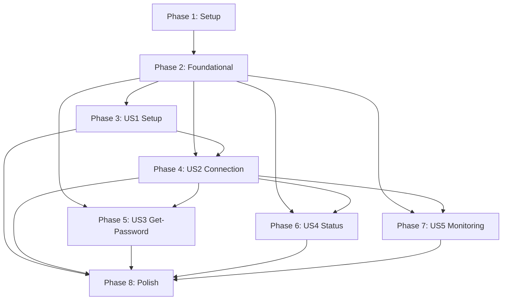

# Tasks: OTP-Integrated VPN CLI with Secure Credential Management

**Input**: Design documents from `/specs/001-cli-tool/`
**Prerequisites**: plan.md, spec.md, research.md, data-model.md, contracts/

**Tests**: Included per constitution requirement (>90% coverage for security modules)

**Organization**: Tasks are grouped by user story to enable independent implementation and testing of each story.

## Format: `[ID] [P?] [Story] Description`

- **[P]**: Can run in parallel (different files, no dependencies)
- **[Story]**: Which user story this task belongs to (e.g., US1, US2, US3)
- Include exact file paths in descriptions

---

## Phase 1: Setup (Shared Infrastructure)

**Purpose**: Project initialization and basic structure

- [x] T001 Create Cargo workspace structure with binary crate (`src/`) and library crate (`akon-core/`)
- [x] T002 Initialize Cargo.toml with workspace members and shared dependencies (secrecy, thiserror, anyhow, serde, toml)
- [x] T003 [P] Create build.rs for bindgen FFI bindings to libopenconnect in `akon-core/`
- [x] T004 [P] Setup .cargo/config.toml with build configuration for libopenconnect linkage
- [x] T005 [P] Configure clippy, rustfmt, and .gitignore for Rust project
- [x] T006 [P] Add dev-dependencies for testing (cargo-tarpaulin or cargo-llvm-cov)

---

## Phase 2: Foundational (Blocking Prerequisites)

**Purpose**: Core infrastructure that MUST be complete before ANY user story can be implemented

**⚠️ CRITICAL**: No user story work can begin until this phase is complete

- [x] T007 [P] Define error types with thiserror in `akon-core/src/error.rs` (KeyringError, ConfigError, VpnError, OtpError)
- [x] T008 [P] Implement Secret type wrappers in `akon-core/src/types.rs` (OtpSecret, TotpToken using secrecy::Secret<T>)
- [x] T009 [P] Setup tracing + tracing-journald logging infrastructure in `akon-core/src/lib.rs`
- [x] T010 [P] Create clap CLI structure in `src/main.rs` with command routing (setup, vpn, get-password subcommands)
- [x] T011 Generate OpenConnect FFI bindings via build.rs (validate libopenconnect headers available)
- [x] T012 [P] Write unit tests for error type conversions and exit code mapping in `akon-core/src/error.rs`

**Checkpoint**: Foundation ready - user story implementation can now begin in parallel

---

## Phase 3: User Story 1 - First-Time Setup with Secure Credential Storage (Priority: P1) 🎯 MVP

**Goal**: Enable users to securely configure VPN credentials via interactive setup command, storing secrets in GNOME Keyring and non-sensitive config in TOML file

**Independent Test**: Run `akon setup` on fresh system → verify credentials in keyring (secret-tool lookup) → verify config.toml contains no secrets

### Tests for User Story 1 (TDD - Write First, Ensure Fail)

- [x] T013 [P] [US1] Unit test for VpnConfig validation in `akon-core/tests/config_tests.rs` (test valid/invalid URLs, empty username, invalid port)
- [x] T014 [P] [US1] Unit test for OtpSecret Base32 validation in `akon-core/tests/auth_tests.rs` (test valid Base32, invalid characters, wrong length)
- [x] T015 [P] [US1] Integration test for keyring store/retrieve in `tests/integration/keyring_tests.rs` (requires GNOME Keyring mock or D-Bus mock)
- [x] T016 [US1] Integration test for setup command flow in `tests/integration/setup_tests.rs` (test overwrite confirmation, keyring lock detection)

### Implementation for User Story 1

- [x] T017 [P] [US1] Implement VpnConfig struct with serde derives in `akon-core/src/config/mod.rs`
- [x] T018 [P] [US1] Implement VpnConfig::validate() method in `akon-core/src/config/mod.rs`
- [x] T019 [P] [US1] Implement TOML config file I/O (load, save) in `akon-core/src/config/toml_config.rs`
- [x] T020 [P] [US1] Implement OtpSecret struct with Base32 validation in `akon-core/src/auth/mod.rs`
- [x] T021 [US1] Implement keyring operations (store, retrieve, detect existing) in `akon-core/src/auth/keyring.rs` using secret-service crate
- [x] T022 [US1] Implement setup command in `src/cli/setup.rs` (interactive prompts, validation, keyring + config save)
- [x] T023 [US1] Add overwrite confirmation logic to setup command (detect existing credentials, prompt "Overwrite existing setup? (y/N)")
- [x] T024 [US1] Add keyring availability check and graceful error handling in setup command
- [x] T025 [US1] Ensure all logging in setup command sanitizes sensitive values (no OTP secrets in logs)
- [x] T026 [US1] Run integration tests for US1 to validate implementation

**Checkpoint**: User Story 1 complete - users can run `akon setup` and credentials are securely stored

---

## Phase 4: User Story 2 - Automatic VPN Connection with OTP Generation (Priority: P1) 🎯 MVP

**Goal**: Enable users to connect to VPN automatically using stored credentials, with TOTP generation and OpenConnect FFI integration

**Independent Test**: After setup, run `akon vpn on` → verify connection established → check tun0 interface exists → verify no OTP tokens in logs

### Tests for User Story 2 (TDD - Write First, Ensure Fail)

- [x] T027 [P] [US2] Unit test for TOTP generation in `akon-core/tests/auth_tests.rs` (test RFC 6238 compliance, 30s time step, HMAC-SHA1/SHA256)
- [x] T028 [P] [US2] Unit test for ConnectionState transitions in `akon-core/tests/vpn_tests.rs` (test disconnected → connecting → connected → error states)
- [x] T029 [P] [US2] Integration test for OpenConnect FFI wrapper in `tests/integration/openconnect_tests.rs` (mock or stub FFI calls)
- [x] T030 [US2] Integration test for daemon spawn and IPC in `tests/integration/daemon_tests.rs` (test parent blocks until child signals, Unix socket communication)
- [x] T031 [US2] System test for vpn on command in `tests/integration/vpn_on_tests.rs` (requires mock VPN server or integration test environment)

### Implementation for User Story 2

- [x] T032 [P] [US2] Implement TOTP generation in `akon-core/src/auth/totp.rs` using totp-lite crate (RFC 6238, 30s steps, HMAC-SHA1/SHA256)
- [x] T033 [P] [US2] Implement ConnectionState enum and state machine in `akon-core/src/vpn/state.rs` (with Arc<Mutex<ConnectionState>> for sharing)
- [x] T034 [US2] Implement OpenConnect FFI safe wrappers in `akon-core/src/vpn/openconnect.rs` (connection establishment, OTP callback, error mapping)
- [x] T035 [US2] Implement daemon process management in `src/daemon/process.rs` (daemonize crate, PID file handling)
- [x] T036 [US2] Implement Unix socket IPC for daemon communication in `src/daemon/ipc.rs` (parent-child signals, connection status messages)
- [x] T037 [US2] Implement vpn on command in `src/cli/vpn.rs` (load config, retrieve OTP secret, generate token, spawn daemon, block until connected)
- [x] T041 [US2] Implement vpn off command in `src/cli/vpn.rs` (graceful daemon shutdown, cleanup PID file and Unix socket)
- [x] T042 [US2] Add idempotency to vpn off command (handle already disconnected state gracefully)
- [x] T038 [US2] Add idempotency check to vpn on command (detect existing daemon via PID file, return success if already connected)
- [x] T039 [US2] Implement error category distinction in vpn on command (authentication vs network vs configuration errors per FR-009)
- [x] T040 [US2] Add exit code mapping (0=success, 1=auth/network failure, 2=config error)
- [x] T043 [US2] Ensure all logging sanitizes OTP tokens (use secrecy::Secret<T>, no ExposeSecret in log calls)
- [x] T044 [US2] Run integration and system tests for US2 to validate implementation

**Checkpoint**: User Story 2 complete - users can run `akon vpn on` and `akon vpn off` to manage VPN connection

---

## Phase 5: User Story 3 - Manual OTP Generation for External Use (Priority: P2)

**Goal**: Enable users to generate OTP tokens for use outside the CLI (browser login, troubleshooting)

**Independent Test**: After setup, run `akon get-password` → verify only 6-8 digit token on stdout → pipe to another command → verify no formatting noise

### Tests for User Story 3 (TDD - Write First, Ensure Fail)

- [x] T045 [P] [US3] Unit test for get-password command output format in `tests/unit/get_password_tests.rs` (test stdout only contains token, errors go to stderr)
- [x] T046 [US3] Integration test for get-password in `tests/integration/get_password_tests.rs` (test with missing keyring entry, test piping behavior)

### Implementation for User Story 3

- [x] T047 [US3] Implement get-password command in `src/cli/get_password.rs` (retrieve OTP secret, generate token, output to stdout only)
- [x] T048 [US3] Ensure errors written to stderr (not stdout) for pipe-friendly behavior
- [x] T049 [US3] Add exit code handling (0=success, 1=keyring error)
- [x] T050 [US3] Run integration tests for US3 to validate implementation

**Checkpoint**: User Story 3 complete - users can run `akon get-password` for manual OTP generation

---

## Phase 6: User Story 4 - VPN State Management (On/Off/Status) (Priority: P2)

**Goal**: Enhance VPN lifecycle control with status command to check connection state

**Independent Test**: With VPN connected, run `akon vpn status` → verify displays server, uptime, connection state → with VPN disconnected, verify shows disconnected status

### Tests for User Story 4 (TDD - Write First, Ensure Fail)

- [x] T051 [P] [US4] Integration test for vpn status command in `tests/integration/vpn_status_tests.rs` (test connected state, disconnected state, daemon not running)

### Implementation for User Story 4

- [x] T052 [US4] Implement vpn status command in `src/cli/vpn.rs` (read daemon PID file, query connection state via IPC, display human-readable output)
- [x] T053 [US4] Add connection metadata to ConnectionState (connection start time, server endpoint, uptime calculation)
- [x] T054 [US4] Add IPC status query message type to `src/daemon/ipc.rs`
- [x] T055 [US4] Update daemon to respond to status queries with current ConnectionState
- [x] T056 [US4] Run integration tests for US4 to validate implementation

**Checkpoint**: User Story 4 complete - users can run `akon vpn status` to check connection state

---

## Phase 7: User Story 5 - Automated Reconnection Monitoring (Priority: P3)

**Goal**: Enable automatic VPN reconnection after network disruptions with exponential backoff and rate limiting detection

**Independent Test**: Connect VPN → disable WiFi → re-enable WiFi → verify automatic reconnection within 30 seconds → check logs for reconnection events

### Tests for User Story 5 (TDD - Write First, Ensure Fail)

- [ ] T057 [P] [US5] Unit test for exponential backoff logic in `akon-core/tests/vpn_tests.rs` (test 5s → 10s → 20s → 40s → 80s → 160s → 300s cap sequence)
- [ ] T058 [P] [US5] Unit test for rate limit detection in `akon-core/tests/vpn_tests.rs` (test HTTP 429 error handling)
- [ ] T059 [US5] Integration test for monitoring thread in `tests/integration/monitor_tests.rs` (simulate network change events, verify reconnection)

### Implementation for User Story 5

- [ ] T060 [P] [US5] Implement exponential backoff module in `akon-core/src/vpn/backoff.rs` (initial 5s, max 5min, factor 2.0 per FR-021)
- [ ] T061 [P] [US5] Implement rate limit detection in `akon-core/src/vpn/openconnect.rs` (detect HTTP 429 or equivalent from OpenConnect library)
- [ ] T062 [US5] Implement network state monitoring thread in `src/daemon/monitor.rs` (NetworkManager D-Bus integration, spawn OS thread with std::thread)
- [ ] T063 [US5] Add reconnection logic to monitoring thread (detect disconnect, apply backoff, attempt reconnection)
- [ ] T064 [US5] Add user-initiated disconnect detection (respect vpn off command, set flag to prevent auto-reconnect per FR-020)
- [ ] T065 [US5] Add rate limit handling to monitoring thread (on HTTP 429, log error, stop retries until manual reconnection per FR-023)
- [ ] T066 [US5] Add suspend/resume detection to monitoring thread (systemd login D-Bus signals)
- [ ] T067 [US5] Ensure monitoring thread shares ConnectionState via Arc<Mutex<ConnectionState>>
- [ ] T068 [US5] Add structured logging for all reconnection events (no sensitive data)
- [ ] T069 [US5] Run integration tests for US5 to validate implementation

**Checkpoint**: User Story 5 complete - VPN automatically reconnects after network disruptions with proper backoff and rate limiting

---

## Phase 8: Polish & Cross-Cutting Concerns

**Purpose**: Improvements that affect multiple user stories and final validation

- [ ] T070 [P] Security audit: Review all logging calls to ensure no sensitive data exposure (grep for OTP, token, secret, password in log statements)
- [ ] T071 [P] Security audit: Review all unsafe FFI code in `akon-core/src/vpn/openconnect.rs` for memory safety issues
- [ ] T072 Run cargo clippy --all-targets --all-features and fix all warnings
- [ ] T073 Run cargo fmt --all and ensure consistent formatting
- [ ] T074 [P] Validate >90% code coverage for security modules (akon-core/src/auth/, akon-core/src/types.rs) using cargo-tarpaulin or cargo-llvm-cov
- [ ] T075 [P] Update README.md with installation instructions, quick start guide, and troubleshooting section
- [ ] T076 [P] Validate quickstart.md scenarios manually (run through all examples)
- [ ] T077 Code cleanup: Remove dead code, unused imports, TODO comments
- [ ] T078 Performance validation: Verify TOTP generation <100ms, connection establishment <10s (excluding network latency)
- [ ] T079 Final end-to-end test: Fresh install → setup → connect → disconnect → reconnect → get-password → status
- [ ] T080 Update .github/copilot-instructions.md with any new learnings from implementation

---

## Dependencies & Execution Order

### Phase Dependencies



- **Setup (Phase 1)**: No dependencies - can start immediately
- **Foundational (Phase 2)**: Depends on Setup completion - BLOCKS all user stories
- **User Story 1 (Phase 3)**: Depends on Foundational phase - No other dependencies
- **User Story 2 (Phase 4)**: Depends on Foundational phase AND User Story 1 (needs config + keyring modules)
- **User Story 3 (Phase 5)**: Depends on Foundational phase AND User Story 2 (needs OTP generation module)
- **User Story 4 (Phase 6)**: Depends on Foundational phase AND User Story 2 (needs daemon and IPC)
- **User Story 5 (Phase 7)**: Depends on Foundational phase AND User Story 2 (needs connection module)
- **Polish (Phase 8)**: Depends on all implemented user stories

### MVP Scope (Recommended)

**Minimum Viable Product**: Phases 1-4 only (Setup → Foundational → US1 → US2)

This delivers the core value proposition:

- ✅ Secure credential storage
- ✅ Automatic VPN connection with OTP
- ✅ VPN disconnect

**Iteration 2**: Add Phase 5 (get-password command)
**Iteration 3**: Add Phase 6 (status command)
**Iteration 4**: Add Phase 7 (auto-reconnect monitoring)

### Parallel Opportunities

**Within Each Phase:**

- All tasks marked [P] can run in parallel within their phase
- Tests marked [P] can all run in parallel before implementation starts

**Across Phases (with sufficient team capacity):**

- After Foundational (Phase 2) completes:
  - User Story 1 (Phase 3) can start immediately
  - Once US1 completes, US2/US3/US4/US5 can all start in parallel (if team has 4+ developers)
  - In practice, recommend sequential priority order: US1 → US2 → US3 → US4 → US5

**Example Parallel Execution for Setup Phase:**

```bash
# Launch all independent setup tasks simultaneously:
Task T002: Initialize Cargo.toml & dependencies
Task T003: Create build.rs for bindgen
Task T004: Setup .cargo/config.toml
Task T005: Configure clippy, rustfmt, .gitignore
Task T006: Add dev-dependencies
# Then T001 (workspace structure) must complete before others can write files
```

**Example Parallel Execution for User Story 1:**

```bash
# Write all tests first (TDD):
Task T013: Unit test for VpnConfig validation
Task T014: Unit test for OtpSecret Base32 validation
Task T015: Integration test for keyring operations
Task T016: Integration test for setup command flow

# Then implement models in parallel:
Task T017: VpnConfig struct implementation
Task T020: OtpSecret struct implementation

# Then sequential implementation:
Task T018: VpnConfig::validate() method
Task T019: TOML config I/O
Task T021: Keyring operations
Task T022: Setup command
Task T023: Overwrite confirmation logic
Task T024: Keyring availability check
Task T025: Logging sanitization
Task T026: Run integration tests
```

---

## Implementation Strategy

### Test-Driven Development (TDD)

Per project constitution and SC-008 (>90% coverage for security modules), follow red-green-refactor cycle:

1. **Red**: Write test that demonstrates desired behavior → test fails
2. **Green**: Implement minimal code to pass test
3. **Refactor**: Clean up code while keeping tests green

**Critical for security modules**: `akon-core/src/auth/`, `akon-core/src/types.rs`

### Independent User Story Delivery

Each user story phase is a complete, independently testable increment:

- **US1 alone**: Users can configure credentials securely
- **US1 + US2**: Users can configure and connect to VPN
- **US1 + US2 + US3**: Plus manual OTP generation for external use
- **US1 + US2 + US3 + US4**: Plus connection status checking
- **US1 + US2 + US3 + US4 + US5**: Full featured tool with auto-reconnect

### Security-First Implementation

- **Never log sensitive values**: All OTP secrets, tokens, passwords wrapped in `secrecy::Secret<T>`
- **Keyring-only storage**: No plaintext credentials in files or environment variables
- **FFI safety**: Document all unsafe blocks, validate pointer lifetimes, use CString for C interop
- **Regular audits**: Tasks T070-T071 perform security audits before release

### Incremental Complexity

- **Phase 2 (Foundational)**: Get error handling and type system right before business logic
- **Phase 3 (US1)**: Validate security model with simple setup command
- **Phase 4 (US2)**: Add complexity of FFI, daemon, and IPC
- **Phase 5-7**: Layer additional features on proven foundation

---

## Task Summary

**Total Tasks**: 80
**Tasks per Phase**:

- Phase 1 (Setup): 6 tasks
- Phase 2 (Foundational): 6 tasks (12 total)
- Phase 3 (US1 - Setup): 14 tasks (26 total)
- Phase 4 (US2 - Connection): 18 tasks (44 total)
- Phase 5 (US3 - Get-Password): 4 tasks (48 total)
- Phase 6 (US4 - Status): 5 tasks (53 total)
- Phase 7 (US5 - Monitoring): 13 tasks (66 total)
- Phase 8 (Polish): 14 tasks (80 total)

**MVP Scope** (Phases 1-4): 44 tasks
**Estimated MVP Duration**: 4-5 weeks (per implementation roadmap in plan.md)

**Parallel Opportunities**: 29 tasks marked [P] for parallel execution
**Test Tasks**: 16 test tasks (TDD approach per constitution requirement)

**Security Coverage Target**: >90% for `akon-core/src/auth/` and `akon-core/src/types.rs` (validated in T074)

---

**Next Steps**: Begin with Phase 1 (Setup) tasks T001-T006 to initialize project structure.
