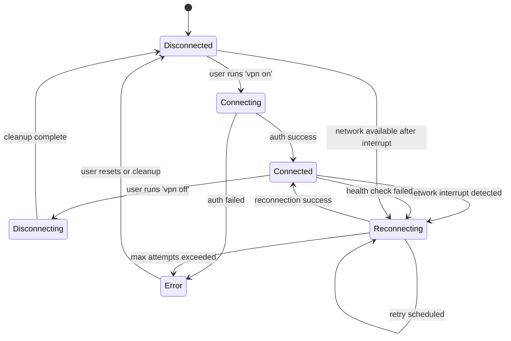
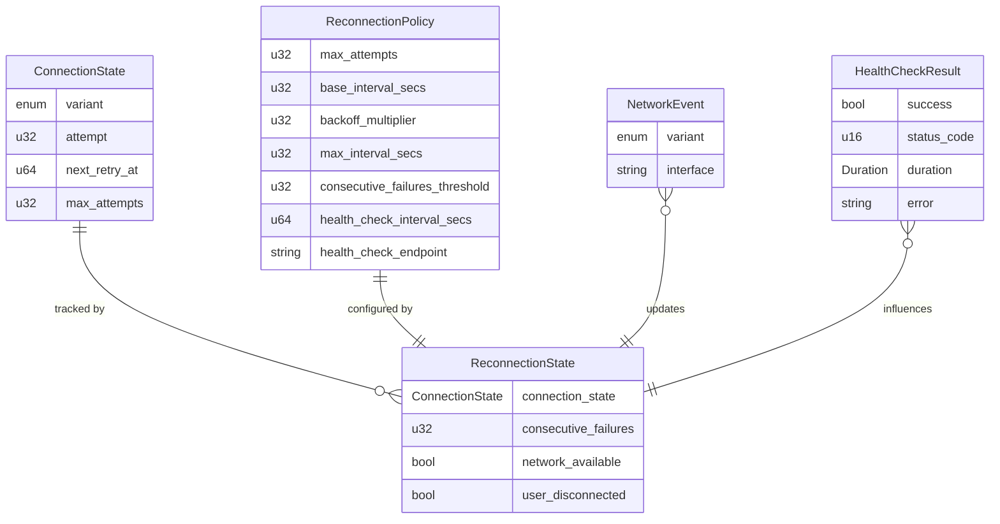
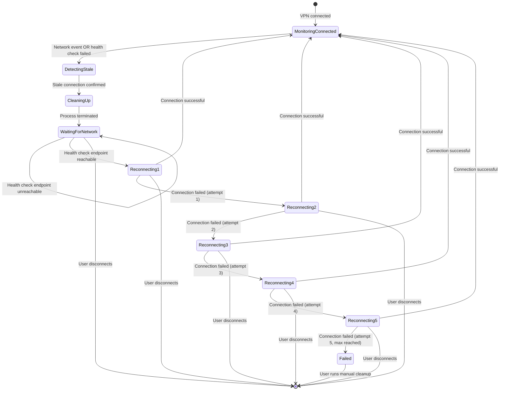

# Data Model: Network Interruption Detection and Automatic Reconnection

**Date**: 2025-11-04
**Phase**: 1 (Design & Contracts)

## Overview

This document defines the data structures, state machines, and relationships for the automatic reconnection feature. All types use Rust conventions and leverage existing serde serialization.

---

## Core Entities

### 1. ConnectionState (Modified)

**Location**: `akon-core/src/vpn/state.rs`

**Purpose**: Represents the current VPN connection lifecycle state

**Type Definition**:

```rust
use std::time::{SystemTime, UNIX_EPOCH};

#[derive(Debug, Clone, PartialEq, Eq, serde::Serialize, serde::Deserialize)]
pub enum ConnectionState {
    /// Not connected
    Disconnected,

    /// User-initiated connection in progress
    Connecting,

    /// Successfully connected with metadata
    Connected(ConnectionMetadata),

    /// User-initiated disconnection in progress
    Disconnecting,

    /// Automatic reconnection in progress
    Reconnecting {
        /// Current attempt number (1-indexed)
        attempt: u32,
        /// Unix timestamp for next retry attempt
        next_retry_at: Option<u64>,
        /// Total maximum attempts allowed
        max_attempts: u32,
    },

    /// Connection failed with an error
    Error(String),
}
```

**State Transitions**:



**Serialization**:

- Uses derived `serde::Serialize/Deserialize` for state persistence
- `next_retry_at` as Unix timestamp for timezone-independent storage
- Enum variant serialized as tagged union in TOML

**Validation Rules**:

- `attempt` must be ≤ `max_attempts`
- `next_retry_at` must be in the future when state is active
- Cannot transition from `Reconnecting` to `Connecting` (would lose retry context)

---

### 2. ReconnectionPolicy

**Location**: `akon-core/src/vpn/reconnection.rs`

**Purpose**: Configuration for automatic reconnection behavior

**Type Definition**:

```rust
#[derive(Debug, Clone, serde::Serialize, serde::Deserialize)]
pub struct ReconnectionPolicy {
    /// Maximum number of reconnection attempts before giving up
    #[serde(default = "default_max_attempts")]
    pub max_attempts: u32,

    /// Base interval in seconds for exponential backoff
    #[serde(default = "default_base_interval")]
    pub base_interval_secs: u32,

    /// Multiplier for exponential backoff (typically 2)
    #[serde(default = "default_backoff_multiplier")]
    pub backoff_multiplier: u32,

    /// Maximum interval in seconds (cap for exponential growth)
    #[serde(default = "default_max_interval")]
    pub max_interval_secs: u32,

    /// Number of consecutive health check failures before triggering reconnection
    #[serde(default = "default_consecutive_failures")]
    pub consecutive_failures_threshold: u32,

    /// Health check interval in seconds
    #[serde(default = "default_health_check_interval")]
    pub health_check_interval_secs: u64,

    /// Health check endpoint URL (HTTP/HTTPS)
    pub health_check_endpoint: String,
}

fn default_max_attempts() -> u32 { 5 }
fn default_base_interval() -> u32 { 5 }
fn default_backoff_multiplier() -> u32 { 2 }
fn default_max_interval() -> u32 { 60 }
fn default_consecutive_failures() -> u32 { 3 }
fn default_health_check_interval() -> u64 { 60 }
```

**Config File Example** (`~/.config/akon/config.toml`):

```toml
[reconnection]
max_attempts = 5
base_interval_secs = 5
backoff_multiplier = 2
max_interval_secs = 60
consecutive_failures_threshold = 3
health_check_interval_secs = 60
health_check_endpoint = "https://vpn.example.com/healthz"
```

**Validation Rules**:

- `max_attempts` must be > 0 and ≤ 20 (prevent infinite loops)
- `base_interval_secs` must be > 0 and ≤ 300 (prevent too long initial wait)
- `backoff_multiplier` must be ≥ 1 and ≤ 10
- `max_interval_secs` must be ≥ `base_interval_secs`
- `consecutive_failures_threshold` must be > 0 and ≤ 10
- `health_check_interval_secs` must be ≥ 10 and ≤ 3600 (1 hour)
- `health_check_endpoint` must be valid HTTP/HTTPS URL

---

### 3. NetworkEvent

**Location**: `akon-core/src/vpn/network_monitor.rs`

**Purpose**: Represents network state changes detected via D-Bus

**Type Definition**:

```rust
#[derive(Debug, Clone, PartialEq, Eq)]
pub enum NetworkEvent {
    /// Network connectivity established
    NetworkUp {
        /// Interface name (e.g., "wlan0", "eth0")
        interface: String,
    },

    /// Network connectivity lost
    NetworkDown {
        /// Interface name
        interface: String,
    },

    /// Active interface changed (WiFi network switch)
    InterfaceChanged {
        /// Previous interface
        old_interface: String,
        /// New interface
        new_interface: String,
    },

    /// System resumed from suspend/sleep
    SystemResumed,

    /// System about to suspend (allows cleanup before suspend)
    SystemSuspending,
}
```

**Source**: NetworkManager D-Bus signals via `zbus`

**Mapping**:

- `NetworkUp/Down`: `org.freedesktop.NetworkManager.StateChanged` signal
- `InterfaceChanged`: `org.freedesktop.NetworkManager.ActiveConnection` property change
- `SystemResumed/Suspending`: `org.freedesktop.login1.Manager` signals

---

### 4. HealthCheckResult

**Location**: `akon-core/src/vpn/health_check.rs`

**Purpose**: Result of a single health check attempt

**Type Definition**:

```rust
use std::time::Duration;

#[derive(Debug, Clone)]
pub struct HealthCheckResult {
    /// Whether the check succeeded
    pub success: bool,

    /// HTTP status code if request completed
    pub status_code: Option<u16>,

    /// Time taken for the check
    pub duration: Duration,

    /// Error message if failed
    pub error: Option<String>,

    /// Timestamp of the check
    pub timestamp: SystemTime,
}

impl HealthCheckResult {
    pub fn is_healthy(&self) -> bool {
        self.success && self.status_code.map_or(false, |code| code < 400)
    }
}
```

**Success Criteria**:

- HTTP request completed within 5 seconds
- Status code 2xx or 3xx
- No network errors (timeout, connection refused, etc.)

---

### 5. ReconnectionState (Internal)

**Location**: `akon-core/src/vpn/reconnection.rs`

**Purpose**: Internal state for reconnection manager (not exposed to CLI)

**Type Definition**:

```rust
#[derive(Debug, Clone)]
pub struct ReconnectionState {
    /// Current connection state
    pub connection_state: ConnectionState,

    /// Consecutive health check failures
    pub consecutive_failures: u32,

    /// Last successful health check timestamp
    pub last_successful_check: Option<SystemTime>,

    /// Network availability (from NetworkMonitor)
    pub network_available: bool,

    /// User-initiated disconnect flag (prevents auto-reconnect)
    pub user_disconnected: bool,
}

impl ReconnectionState {
    pub fn should_attempt_reconnection(&self) -> bool {
        !self.user_disconnected
            && self.network_available
            && matches!(self.connection_state, ConnectionState::Disconnected)
    }

    pub fn should_trigger_health_check_reconnection(
        &self,
        policy: &ReconnectionPolicy,
    ) -> bool {
        self.consecutive_failures >= policy.consecutive_failures_threshold
            && matches!(self.connection_state, ConnectionState::Connected(_))
    }
}
```

---

## Relationships

### Entity Relationship Diagram



---

## State Machine

### Reconnection Flow



---

## Persistence Schema

**File**: `~/.config/akon/reconnection_state.toml`

```toml
version = "1.0"

[connection_state]
variant = "Reconnecting"
attempt = 3
next_retry_at = 1699104000
max_attempts = 5

[internal_state]
consecutive_failures = 0
network_available = true
user_disconnected = false
last_successful_check = 1699103940
```

**Atomic Write Strategy**:

1. Serialize state to temp file (`.reconnection_state.toml.tmp`)
2. `fsync()` to ensure data written to disk
3. Atomic rename to target file
4. On load, fallback to default if file missing/corrupted

---

## Validation & Invariants

### Type-Level Invariants

- `attempt` in `ConnectionState::Reconnecting` is always ≤ `max_attempts`
- `next_retry_at` is always in the future when in `Reconnecting` state
- Cannot transition from `Reconnecting` with attempt N to `Reconnecting` with attempt < N

### Runtime Validation

- Configuration validation on load (reject invalid values)
- State validation before persistence (catch corrupted state early)
- Health check URL validation (must be valid HTTP/HTTPS)

---

## Next Steps

Proceed to contract design for:

1. NetworkMonitor interface
2. HealthChecker interface
3. ReconnectionManager interface
