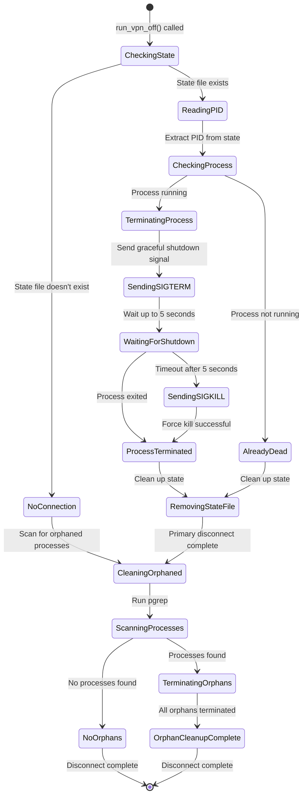
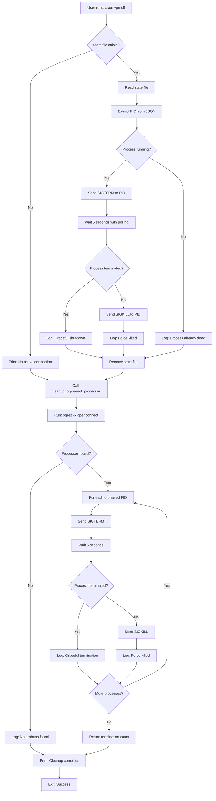

# Data Model: Fix VPN Off Command Cleanup

**Feature**: 004-fix-vpn-off
**Date**: 2025-11-08
**Phase**: 1 - Design

## Overview

This feature primarily involves process management and control flow rather than data modeling. However, there are key entities involved in state tracking and process identification.

## Key Entities

### 1. VPN State File

**Purpose**: Tracks active VPN connection state for status checks and disconnect operations.

**Location**: `/tmp/akon_vpn_state.json`

**Format**: JSON

**Schema**:

```json
{
  "ip": "string",           // VPN-assigned IP address (e.g., "10.0.0.5")
  "device": "string",       // TUN/TAP device name (e.g., "tun0")
  "connected_at": "string", // ISO 8601 timestamp (e.g., "2025-11-08T10:30:00Z")
  "pid": "number"           // OpenConnect process ID (e.g., 12345)
}
```

**Validation Rules**:

- `ip`: Must be valid IPv4 or IPv6 address
- `device`: Must be non-empty string, typically matches `tun\d+` pattern
- `connected_at`: Must be valid RFC3339 timestamp
- `pid`: Must be positive integer

**Lifecycle**:

- **Created**: When VPN connection is established (in `run_vpn_on()`)
- **Read**: When checking status or disconnecting
- **Deleted**: When VPN is disconnected (in `run_vpn_off()`)

**Changes for This Feature**: None. File format and lifecycle remain unchanged.

---

### 2. Process Identifier (PID)

**Purpose**: Unique identifier for OpenConnect system processes that need to be terminated.

**Type**: `i32` (signed 32-bit integer) in Rust, represented as `nix::unistd::Pid`

**Sources**:

1. **Tracked PID**: Retrieved from state file (`state.pid`)
2. **Orphaned PIDs**: Discovered via `pgrep -x openconnect` command

**Validation**:

- Must be positive integer
- Must correspond to actual running process (verified via `ps` or `kill(pid, None)`)

**Operations**:

- **Signal sending**: `SIGTERM` (graceful), `SIGKILL` (forceful)
- **Status check**: `kill(pid, None)` returns `ESRCH` if process doesn't exist
- **Process lookup**: `pgrep -x openconnect` returns list of matching PIDs

---

### 3. Cleanup Result

**Purpose**: Tracks the outcome of the cleanup operation for logging and user feedback.

**Type**: `Result<usize, AkonError>` (return type of `cleanup_orphaned_processes()`)

**States**:

- **Success**: `Ok(count)` where `count` is number of terminated processes (0 or more)
- **Failure**: `Err(AkonError::Vpn(VpnError::ConnectionFailed { reason }))` when process search fails

**Usage**:

```rust
match cleanup_orphaned_processes() {
    Ok(0) => {
        // No orphaned processes found
        println!("✓ No orphaned processes found");
    }
    Ok(count) => {
        // Successfully terminated processes
        println!("✓ Terminated {} process(es)", count);
    }
    Err(e) => {
        // Failed to search for or terminate processes
        eprintln!("⚠ Cleanup error: {}", e);
    }
}
```

---

## State Transitions

### Disconnect Operation State Machine



**State Descriptions**:

- **CheckingState**: Initial state, checking for existing VPN connection
- **NoConnection**: No state file exists, no tracked connection
- **ReadingPID**: Parsing state file to extract OpenConnect PID
- **CheckingProcess**: Verifying if tracked process is still running
- **AlreadyDead**: Tracked process already terminated (stale state file)
- **TerminatingProcess**: Attempting to terminate tracked process
- **SendingSIGTERM**: Graceful shutdown signal sent
- **WaitingForShutdown**: Polling for process termination (500ms intervals, max 10 attempts)
- **SendingSIGKILL**: Force kill signal sent after timeout
- **ProcessTerminated**: Tracked process no longer running
- **RemovingStateFile**: Deleting state file to mark disconnected
- **CleaningOrphaned**: Scanning for and terminating any orphaned OpenConnect processes
- **ScanningProcesses**: Running `pgrep -x openconnect` to find orphaned processes
- **NoOrphans**: No orphaned processes found (count = 0)
- **TerminatingOrphans**: Found orphaned processes, terminating each with SIGTERM → wait → SIGKILL pattern
- **OrphanCleanupComplete**: All orphaned processes terminated

---

## Data Flow

### Primary Disconnect Flow



---

## Error Handling

### Error Scenarios and Responses

| Scenario | Error Type | Handling Strategy | User Feedback |
|----------|-----------|-------------------|---------------|
| State file read failure | `io::Error` | Assume no connection, proceed to orphan cleanup | "No active VPN connection found" |
| Invalid JSON in state file | `serde_json::Error` | Log warning, proceed to orphan cleanup | "State file corrupted, scanning for processes..." |
| PID not found in state | Parse error | Log error, proceed to orphan cleanup | "Invalid state file, scanning for processes..." |
| Permission denied (EPERM) | `nix::errno::Errno::EPERM` | Log warning, continue to next process | "⚠ Permission denied for process X (may require sudo)" |
| Process already dead (ESRCH) | `nix::errno::Errno::ESRCH` | Log debug, count as successful | "✓ Process X already terminated" |
| `pgrep` command failure | `io::Error` | Return error, fail cleanup | "⚠ Failed to search for OpenConnect processes" |
| SIGTERM send failure | Signal error | Log warning, skip to SIGKILL | "⚠ Failed to send SIGTERM to process X" |
| SIGKILL send failure | Signal error | Log error, continue to next | "⚠ Failed to force-kill process X" |

---

## Assumptions

1. **State File Location**: The `/tmp` directory is writable and accessible
2. **Process Ownership**: OpenConnect processes may be owned by root (started with sudo)
3. **Timeout Adequacy**: 5 seconds is sufficient for graceful OpenConnect shutdown
4. **System Utilities**: `pgrep` and `ps` commands are available on the system
5. **Single Instance**: Only one instance of `akon vpn off` runs at a time (no locking needed)
6. **No Race Conditions**: OpenConnect doesn't spawn child processes that outlive the parent

---

## Future Considerations

### Potential Enhancements (Out of Scope)

1. **Concurrent Cleanup**: Terminate multiple orphaned processes in parallel using `tokio::spawn`
2. **Configurable Timeout**: Allow users to set graceful shutdown timeout in config file
3. **Process Tree Cleanup**: Detect and terminate child processes of OpenConnect
4. **Cleanup History**: Log cleanup operations to a persistent audit trail
5. **Dry Run Mode**: `akon vpn off --dry-run` to preview what would be terminated

---

## Summary

This feature involves minimal data model changes:

- **State File**: No format changes, lifecycle unchanged
- **Process Management**: Leverages existing process identification and signal handling
- **Cleanup Results**: Simple success/failure reporting with termination count

The focus is on **control flow** (when to call cleanup) rather than **data structure** (how to represent data). The existing data model is sufficient for the enhanced cleanup behavior.
