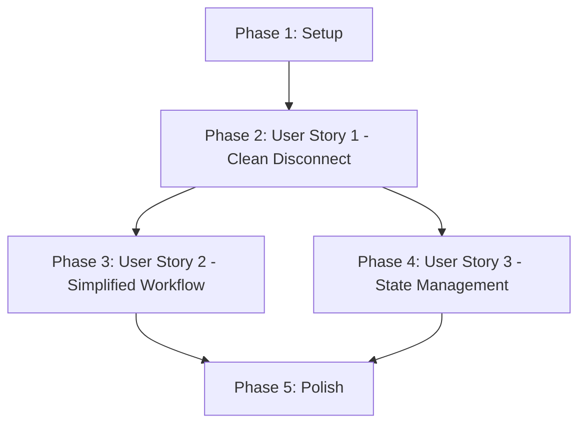

# Tasks: Fix VPN Off Command Cleanup

**Feature**: 004-fix-vpn-off
**Input**: Design documents from `/specs/004-fix-vpn-off/`
**Prerequisites**: plan.md, spec.md, research.md, data-model.md, contracts/

**Organization**: Tasks are grouped by user story to enable independent implementation and testing of each story.

## Format: `[ID] [P?] [Story] Description`

- **[P]**: Can run in parallel (different files, no dependencies)
- **[Story]**: Which user story this task belongs to (e.g., US1, US2, US3)
- Include exact file paths in descriptions

## Path Conventions

Single project structure at repository root:
- Implementation: `src/cli/vpn.rs`
- Reference: `src/daemon/process.rs` (no changes)
- Tests: `tests/vpn_disconnect_tests.rs`, `tests/integration/vpn_disconnect_tests.rs`

---

## Phase 1: Setup (Shared Infrastructure)

**Purpose**: Verify project structure and prepare for implementation

- [ ] T001 Verify Rust project structure and dependencies are in place
- [ ] T002 Review existing `cleanup_orphaned_processes()` function in `src/daemon/process.rs` to understand its behavior
- [ ] T003 [P] Review current `run_vpn_off()` implementation in `src/cli/vpn.rs` to identify insertion points

**Checkpoint**: Understanding of existing code complete - ready to implement user stories

---

## Phase 2: User Story 1 - Clean Disconnect (Priority: P1) 🎯 MVP

**Goal**: Ensure `akon vpn off` terminates all OpenConnect processes (tracked + orphaned), providing comprehensive cleanup in a single command

**Independent Test**: Connect to VPN, disconnect with `akon vpn off`, verify no OpenConnect processes remain running (`pgrep -x openconnect` returns no results)

**Why MVP**: This is the core bug fix - users need reliable disconnect with complete cleanup. Without this, residual processes cause network conflicts and confusion.

### Implementation for User Story 1

- [ ] T004 [US1] Add import for `cleanup_orphaned_processes` in `src/cli/vpn.rs`
  - Add `use crate::daemon::process::cleanup_orphaned_processes;` to imports section

- [ ] T005 [US1] Modify `run_vpn_off()` to handle no-state-file case with cleanup
  - In `src/cli/vpn.rs`, find the section around line 815 that checks `!state_path.exists()`
  - After printing "No active VPN connection found", add orphan cleanup logic
  - Print cleanup progress message with emoji (🧹)
  - Call `cleanup_orphaned_processes()`
  - Handle result: print success/warning messages
  - Return `Ok(())`

- [ ] T006 [US1] Add comprehensive cleanup after tracked PID termination
  - In `src/cli/vpn.rs`, find the section after state file removal (after line ~920)
  - Add user feedback message: "🧹 Cleaning up any orphaned OpenConnect processes..."
  - Call `cleanup_orphaned_processes()`
  - Handle three result cases:
    - `Ok(0)`: Print "✓ No orphaned processes found"
    - `Ok(count)`: Print "✓ Terminated {count} orphaned process(es)"
    - `Err(e)`: Log warning and print "⚠ Warning: Could not verify all processes cleaned up"
  - Add final "✓ Disconnect complete" message

- [ ] T007 [US1] Add structured logging for cleanup operations
  - Add `info!()` log before calling cleanup
  - Add `debug!()` log with cleanup result count
  - Add `warn!()` log for cleanup failures

### Tests for User Story 1

- [ ] T008 [P] [US1] Add test for comprehensive cleanup with active connection
  - In `tests/vpn_disconnect_tests.rs`, create `test_vpn_off_cleans_up_all_processes`
  - Setup: Create state file with tracked PID, spawn 2 orphaned test processes
  - Execute: Call `run_vpn_off().await`
  - Assert: All processes terminated, state file removed, returns `Ok(())`
  - Teardown: Clean up any remaining test processes

- [ ] T009 [P] [US1] Add test for cleanup when no active connection exists
  - In `tests/vpn_disconnect_tests.rs`, create `test_vpn_off_cleans_orphans_no_active_connection`
  - Setup: No state file, spawn 2 orphaned test processes
  - Execute: Call `run_vpn_off().await`
  - Assert: All orphaned processes terminated, returns `Ok(())`
  - Teardown: Clean up any remaining test processes

- [ ] T010 [P] [US1] Add test for graceful handling of permission errors
  - In `tests/vpn_disconnect_tests.rs`, create `test_vpn_off_handles_permission_errors`
  - Setup: Mock or spawn process that cannot be killed without sudo
  - Execute: Call `run_vpn_off().await` without elevated permissions
  - Assert: Returns `Ok(())`, warning logged, user-accessible processes cleaned
  - Teardown: Clean up test processes with sudo if needed

- [ ] T011 [P] [US1] Add integration test for end-to-end disconnect with orphans
  - In `tests/integration/vpn_disconnect_tests.rs`, create integration test
  - Setup: Start actual or mock VPN connection, spawn orphaned processes
  - Execute: Run full disconnect flow
  - Assert: Zero processes remain, state consistent, proper user feedback
  - Teardown: Full cleanup of test artifacts

**Checkpoint**: User Story 1 complete - `akon vpn off` now provides comprehensive cleanup. This is a fully functional MVP that can be shipped.

---

## Phase 3: User Story 2 - Simplified Workflow (Priority: P2)

**Goal**: Deprecate `akon vpn cleanup` command, redirecting users to `akon vpn off` for simplified workflow

**Independent Test**: Run `akon vpn cleanup` and verify it shows deprecation warning, delegates to `akon vpn off`, and completes successfully

**Why this priority**: Improves UX by reducing command confusion. Requires User Story 1 to be working first.

### Implementation for User Story 2

- [ ] T012 [US2] Replace `run_vpn_cleanup()` implementation with deprecation wrapper
  - In `src/cli/vpn.rs`, find `run_vpn_cleanup()` function (around line 1184)
  - Replace entire function body with:
    - Deprecation warning message: "⚠ DEPRECATED: 'akon vpn cleanup' is deprecated."
    - Guidance message: "Use 'akon vpn off' instead."
    - Future removal notice: "This command will be removed in a future version."
    - Empty line for spacing
    - Delegate to `run_vpn_off().await`
  - Update function docstring to indicate deprecation

- [ ] T013 [US2] Update CLI help text to remove `cleanup` from main commands
  - In `src/cli/setup.rs` or wherever help text is displayed (around line 91)
  - Update example commands to only show `akon vpn off` for disconnection
  - Remove or mark as deprecated any references to `akon vpn cleanup`

### Tests for User Story 2

- [ ] T014 [P] [US2] Add test for cleanup command deprecation
  - In `tests/vpn_disconnect_tests.rs`, create `test_vpn_cleanup_shows_deprecation_warning`
  - Setup: Create state file or orphaned processes
  - Execute: Call `run_vpn_cleanup().await`
  - Assert: Returns `Ok(())`, output includes deprecation warning, cleanup performed
  - Teardown: Clean up test artifacts

- [ ] T015 [P] [US2] Add test for help text verification
  - In `tests/vpn_disconnect_tests.rs`, create `test_help_text_only_shows_vpn_off`
  - Execute: Capture help text output
  - Assert: `akon vpn off` documented, `akon vpn cleanup` either absent or marked deprecated
  - No teardown needed

**Checkpoint**: User Story 2 complete - Users now have a simplified, single-command workflow. User Story 1 still works independently.

---

## Phase 4: User Story 3 - Reliable State Management (Priority: P3)

**Goal**: Ensure state file accurately reflects disconnected status after cleanup, enabling reliable status checks

**Independent Test**: Run `akon vpn off`, then run `akon vpn status` and verify it reports "disconnected" or "no active connection"

**Why this priority**: Important for consistency, but depends on cleanup working correctly (P1).

### Implementation for User Story 3

- [ ] T016 [US3] Verify state file removal happens before cleanup
  - In `src/cli/vpn.rs`, review `run_vpn_off()` to ensure state file removal occurs before orphan cleanup call
  - This should already be correct from T006, but verify order is: terminate tracked → remove state → cleanup orphans
  - No code changes needed if order is correct; document with comment if needed

- [ ] T017 [US3] Add state verification logging
  - After state file removal in `src/cli/vpn.rs`, add `debug!()` log confirming state file removed
  - After orphan cleanup completes, add `info!()` log confirming disconnect state updated

### Tests for User Story 3

- [ ] T018 [P] [US3] Add test for state consistency after disconnect
  - In `tests/vpn_disconnect_tests.rs`, create `test_state_file_removed_after_disconnect`
  - Setup: Create state file, spawn processes
  - Execute: Call `run_vpn_off().await`
  - Assert: State file no longer exists, all processes terminated
  - Verify: Calling a hypothetical `get_vpn_status()` would return disconnected
  - Teardown: Clean up any test artifacts

- [ ] T019 [P] [US3] Add test for state consistency when process already dead
  - In `tests/vpn_disconnect_tests.rs`, create `test_state_file_cleaned_when_process_dead`
  - Setup: Create state file with PID of non-existent process, spawn orphaned processes
  - Execute: Call `run_vpn_off().await`
  - Assert: State file removed, orphaned processes cleaned, returns `Ok(())`
  - Teardown: Clean up test artifacts

**Checkpoint**: User Story 3 complete - State management is reliable and consistent. All three user stories now work independently and together.

---

## Phase 5: Polish & Cross-Cutting Concerns

**Purpose**: Improvements that affect multiple user stories and ensure production readiness

- [ ] T020 [P] Run full test suite to verify no regressions
  - Execute: `cargo test` from repository root
  - Assert: All existing tests pass, new tests pass
  - Fix any test failures before proceeding

- [ ] T021 [P] Run clippy for code quality checks
  - Execute: `cargo clippy` from repository root
  - Assert: No new clippy warnings introduced
  - Fix any warnings in modified code

- [ ] T022 [P] Verify code formatting consistency
  - Execute: `cargo fmt --check` from repository root
  - If needed: Run `cargo fmt` to format code
  - Assert: Code follows project formatting standards

- [ ] T023 [P] Update inline documentation and comments
  - In `src/cli/vpn.rs`, update function docstring for `run_vpn_off()` to document comprehensive cleanup
  - In `src/cli/vpn.rs`, update function docstring for `run_vpn_cleanup()` to indicate deprecation
  - Add inline comments explaining cleanup logic flow

- [ ] T024 [P] Manual testing with actual VPN connection
  - Setup: Connect to actual VPN with `sudo akon vpn on`
  - Execute: Disconnect with `sudo akon vpn off`
  - Assert: Clean disconnect message, no OpenConnect processes remain
  - Repeat: Test with orphaned processes present
  - Test: Run `akon vpn cleanup` and verify deprecation warning

- [ ] T025 [P] Update README or user documentation
  - Update quickstart guide or README to show `akon vpn off` as the disconnect command
  - Remove or deprecate references to `akon vpn cleanup`
  - Document that cleanup is now automatic

**Checkpoint**: All polishing complete - feature is production-ready

---

## Dependencies & Execution Strategy

### User Story Dependency Graph

### Story Independence

- **US1 (P1)**: Independent - can ship alone as MVP
- **US2 (P2)**: Depends on US1 (needs working cleanup to deprecate old command)
- **US3 (P3)**: Depends on US1 (needs cleanup working to verify state consistency)

### Parallel Execution Opportunities

**Within User Story 1** (after T007 implementation complete):
- T008, T009, T010, T011 can all run in parallel (different test files/scenarios)

**Within User Story 2** (after T012 complete):
- T014, T015 can run in parallel (different test scenarios)

**Within User Story 3** (after T017 complete):
- T018, T019 can run in parallel (different test scenarios)

**Phase 5 - Polish**:
- T020, T021, T022, T023, T024, T025 can mostly run in parallel
- T020 (test suite) should complete before considering feature done

### Suggested MVP Scope

**Minimum Viable Product**: Phase 1 + Phase 2 (User Story 1 only)

**Rationale**: User Story 1 delivers the core bug fix - comprehensive cleanup on disconnect. This alone provides immediate value and resolves the reported issue. User Stories 2 and 3 are enhancements that can follow in subsequent releases.

**MVP Delivery**: Tasks T001-T011 (11 tasks, estimated 4-6 hours)

---

## Task Summary

**Total Tasks**: 25

**Task Breakdown by Phase**:
- Phase 1 (Setup): 3 tasks
- Phase 2 (User Story 1 - P1): 8 tasks (4 implementation, 4 tests)
- Phase 3 (User Story 2 - P2): 4 tasks (2 implementation, 2 tests)
- Phase 4 (User Story 3 - P3): 4 tasks (2 implementation, 2 tests)
- Phase 5 (Polish): 6 tasks

**Parallel Opportunities**: 15 tasks marked [P] for parallel execution

**Estimated Effort**:
- Setup: 1 hour
- User Story 1: 3-4 hours (MVP)
- User Story 2: 1-2 hours
- User Story 3: 1-2 hours
- Polish: 1-2 hours
- **Total**: 7-11 hours

**Critical Path**: T001 → T002 → T003 → T004 → T005 → T006 → T007 (then tests can parallelize)

---

## Implementation Notes

### Key Files

| File | Changes | Story |
|------|---------|-------|
| `src/cli/vpn.rs` | Modify `run_vpn_off()`, deprecate `run_vpn_cleanup()` | US1, US2 |
| `src/daemon/process.rs` | Reference only, no changes | US1 |
| `tests/vpn_disconnect_tests.rs` | Add comprehensive test cases | US1, US2, US3 |
| `tests/integration/vpn_disconnect_tests.rs` | Add integration tests | US1 |
| `src/cli/setup.rs` | Update help text | US2 |

### Testing Strategy

**Test-Driven Development**: While TDD is encouraged by the constitution, this is a bug fix with existing test infrastructure. Tests can be written alongside or immediately after implementation.

**Test Coverage Goals**:
- Edge case: No active connection (T009)
- Edge case: Permission errors (T010)
- Integration: Full disconnect flow (T011)
- Regression: Existing tests must still pass (T020)

### Success Criteria Mapping

Each success criterion from spec.md is addressed:

- **SC-001** (Zero processes remain): T004-T007 implementation, T008-T011 tests
- **SC-002** (Single command): T012-T013 implementation, T014-T015 tests
- **SC-003** (5 second graceful shutdown): Already implemented in `cleanup_orphaned_processes()`
- **SC-004** (Accurate status): T016-T017 implementation, T018-T019 tests
- **SC-005** (10-15 second completion): Verified by T024 manual testing
- **SC-006** (Zero residual issues): Verified by all tests and T024 manual testing

---

## Next Steps

1. Start with **Phase 1: Setup** (T001-T003) to understand existing code
2. Implement **Phase 2: User Story 1** (T004-T011) for MVP delivery
3. Run tests continuously to catch regressions early
4. Proceed to Phases 3-4 for enhanced UX and reliability
5. Complete Phase 5 for production readiness

**Ready to begin?** Start with T001 and work through tasks sequentially within each phase. Tasks marked [P] can be done in parallel once their dependencies are met.
