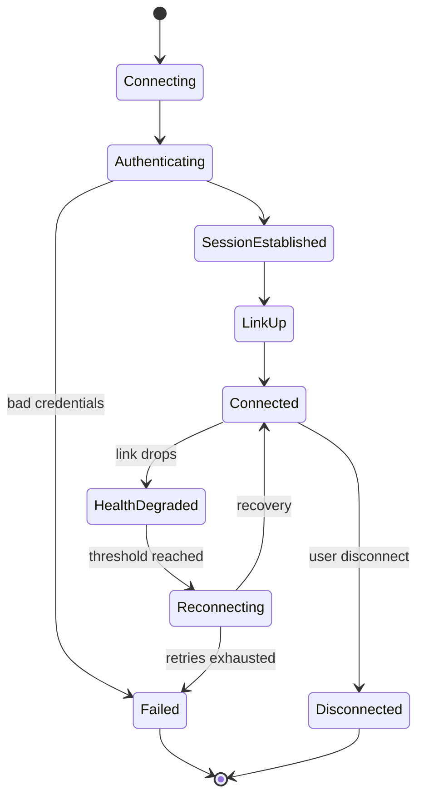
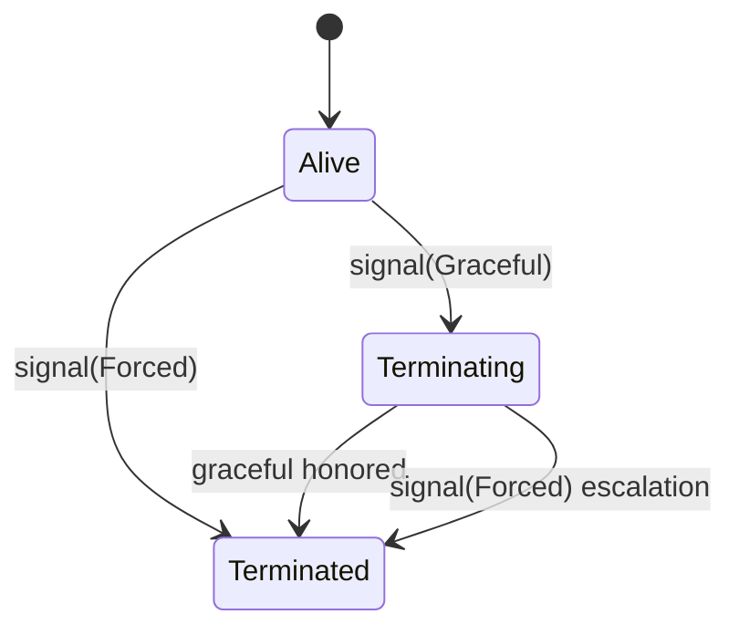
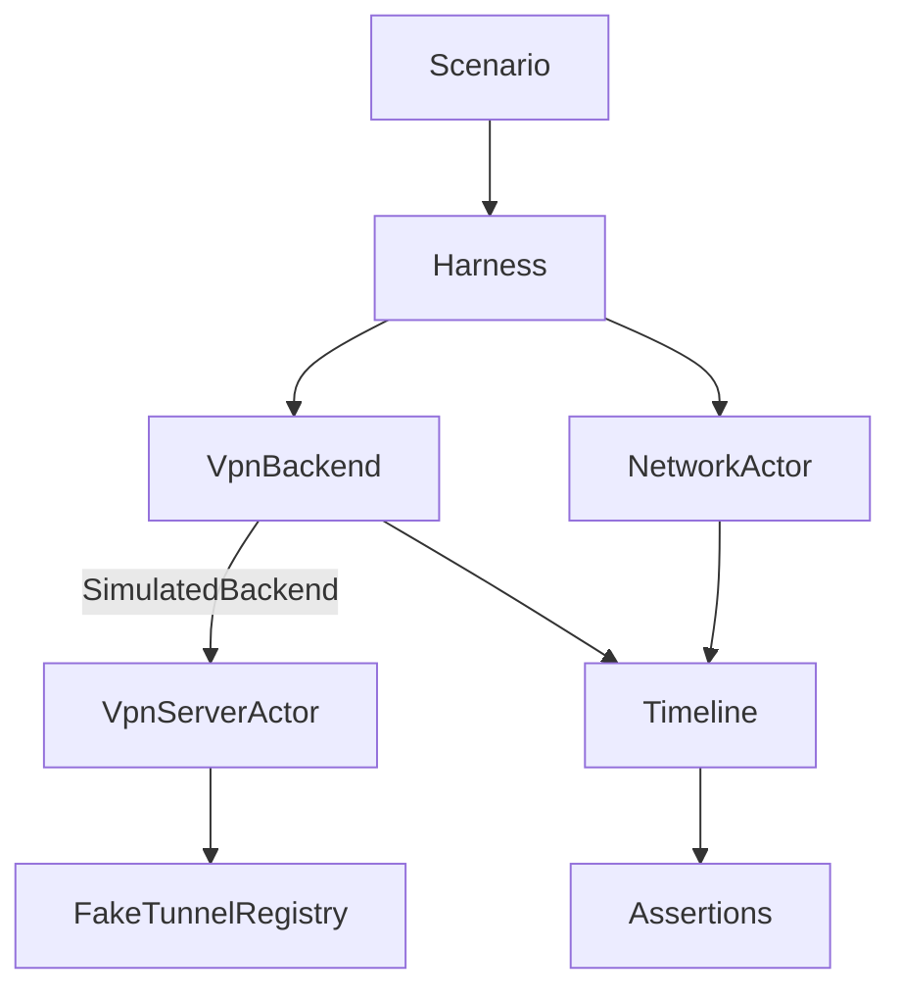

# Data Model: Test Actors Framework

**Feature**: 005-test-actors-framework
**Date**: 2026-06-21
**Phase**: 1 - Design

## Overview

The framework centers on one durable abstraction — the `VpnBackend` boundary — plus the in-memory actors that implement and drive it. All types are backend-agnostic so they survive the eventual removal of `openconnect`.

## Key Entities

### 1. LifecycleEvent (backend-agnostic)

The observable, ordered events any backend emits during a connection's life. This is the contract surface tests assert on. It is intentionally *not* `ConnectionEvent` (which carries openconnect-flavored variants like `F5SessionEstablished`/`UnknownOutput`); instead it is a normalized, durable vocabulary. The openconnect backend maps `ConnectionEvent` → `LifecycleEvent`.

```text
LifecycleEvent =
  | Connecting
  | Authenticating
  | SessionEstablished
  | LinkUp { ip, device }      // tunnel/interface configured
  | Connected { ip, device }   // fully usable
  | HealthDegraded             // link believed down (from network actor / health)
  | Reconnecting { attempt }
  | Disconnected { reason }
  | Failed { kind, detail }
```

### 2. VpnBackend (trait — the durable boundary)

```text
VpnBackend:
  connect(credentials) -> Result<EventStream<LifecycleEvent>, BackendError>
  disconnect() -> Result<(), BackendError>
  is_alive() -> bool
  handle() -> Option<ConnectionHandle>   // PID today, opaque id for native backend
```

Implementors:
- `OpenConnectBackend` — wraps today's path (uses `SystemEffects` internally).
- `SimulatedBackend` — driven by `VpnServerActor` + fake registry (test-only).
- *future* `NativeBackend` — no external deps (out of scope here; enabled by this design).

### 3. SystemEffects (internal seam of OpenConnectBackend only)

```text
SystemEffects (async):
  spawn_vpn(spec) -> Result<SpawnedProcess>
  discover_pid(matcher) -> Option<u32>
  is_alive(pid) -> bool
  signal(pid, Signal) -> Result<()>
```
- `RealSystemEffects` — `sudo openconnect`, `pgrep`, `ps`, `nix::kill` (current behavior).
- (test) a fake used to unit-test `OpenConnectBackend` without root.

> Expected to be deleted when `openconnect` is removed; not part of the public boundary.

### 4. VpnServerActor (test)

In-memory actor playing remote server + transport. Holds a `Vec<ServerStep>` script.

```text
ServerStep =
  | Emit(LifecycleEvent)
  | Delay(logical_ms)
  | DropLink                // simulate silent tunnel death
  | FailAuth(detail)
  | EndSession(reason)
```
- Drives `SimulatedBackend`'s event stream.
- Single responsibility: produce a scripted lifecycle.

### 5. FakeTunnelRegistry (test)

`Arc<Mutex<HashMap<Handle, SimTunnel>>>`. Models what any backend tracks: a live connection handle and its teardown semantics.

```text
SimTunnel { handle, state: Alive | Terminating | Terminated, ignores_graceful: bool }
```
- `is_alive(handle)`, `signal(handle, Graceful|Forced)`.
- `ignores_graceful = true` reproduces the SIGTERM→SIGKILL escalation path.

### 6. NetworkActor (test)

Controls health-check reachability over time, decoupled from real HTTP.

```text
NetworkActor { reachability: Reachable | Unreachable | Script(Vec<bool>) }
  poll() -> HealthCheckResult   // success/failure, no real request
```

### 7. Scenario + ScenarioBuilder (test, backend-independent)

```text
Scenario { steps: Vec<ScenarioStep>, network: NetworkActor }
ScenarioStep = Connect | StayHealthy(polls) | DropNetwork(polls) | Reconnect | Disconnect | ExpectFailure(kind)

ScenarioBuilder:
  .connect()
  .stay_healthy(n)
  .drop_network(n)
  .expect_reconnect()
  .disconnect()
  .expect_auth_failure()
  .build() -> Scenario
```

### 8. TestHarness<B: VpnBackend> + Timeline (test)

```text
TestHarness<B>:
  run(scenario) -> Timeline

Timeline:
  entries: Vec<(logical_time, LifecycleEvent)>
  assert_subsequence(&[LifecycleEvent])   // ordered sub-sequence match
  assert_reached(LifecycleEvent)
  events() -> &[LifecycleEvent]
```
- Generic over backend ⇒ one scenario runs against `SimulatedBackend` and `OpenConnectBackend` (or future `NativeBackend`) unchanged (FR-013, FR-014).

## State Transitions

Backend-agnostic connection lifecycle (happy path + failure + reconnect):



Simulated tunnel teardown:



## Data Flow



## Error Handling

| Condition | Behavior |
|-----------|----------|
| Script exhausted before terminal event | Harness times out (logical) → `Failed { kind: ScriptExhausted }` (no hang) |
| Disconnect on already-terminated tunnel | No-op success (mirrors production) |
| Reconnect with never-recovering network | Retry policy exhausts → terminal `Failed` |
| Backend never reaches `Connected` on auth failure | Stream ends in `Failed`; registry shows no alive tunnel |

## Assumptions

- Logical/compressed time is used for delays (no wall-clock sleeps in scenarios).
- `SimulatedBackend` never performs real I/O; `RealSystemEffects` is never wired under the simulated backend.
- The openconnect backend's `ConnectionEvent` → `LifecycleEvent` mapping is lossless for the states the contract cares about.

## Future Considerations

- A `NativeBackend` (raw TLS/DTLS + TUN, no deps) implements `VpnBackend` and is validated by the *existing* scenario suite before becoming default; once shipped, `OpenConnectBackend` + `SystemEffects` can be deleted with confidence.
- Scenarios can grow to cover suspend/resume, DNS failure, partial routes — all in backend-agnostic terms.

## Summary

The model elevates a backend-agnostic `VpnBackend` + `LifecycleEvent` vocabulary to first-class status, keeps openconnect specifics (`SystemEffects`) as a deletable internal detail, and provides actors (server, tunnel registry, network) plus a generic harness so one scenario suite validates any backend — present or future.
