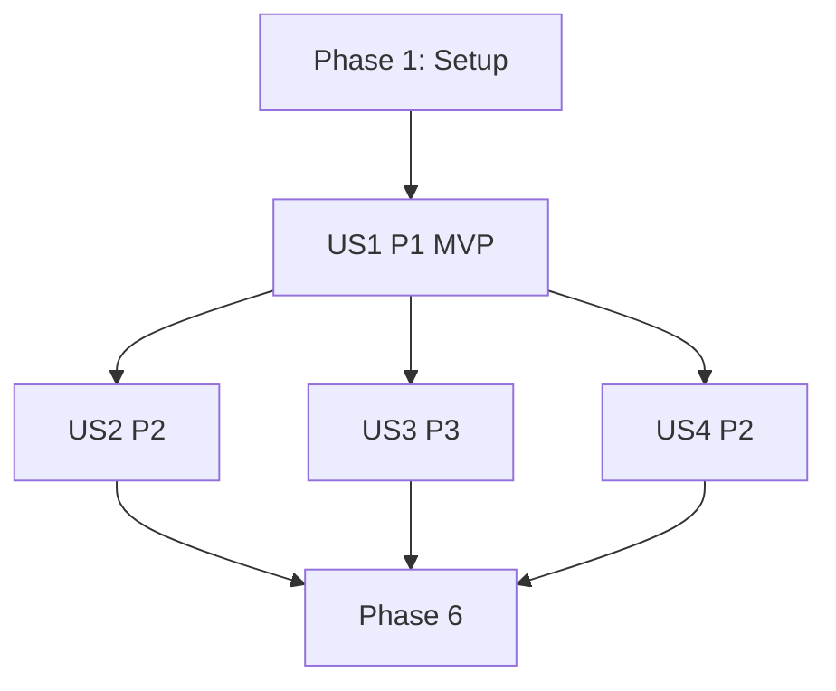

# Tasks: Test Actors Framework

**Feature**: 005-test-actors-framework
**Input**: Design documents from `/specs/005-test-actors-framework/`
**Prerequisites**: plan.md, spec.md, research.md, data-model.md, contracts/

**Organization**: Tasks are grouped by user story to enable independent implementation and testing of each story.

## Format: `[ID] [P?] [Story] Description`
- **[P]**: Can run in parallel (different files, no dependencies)
- **[Story]**: Which user story this task belongs to (US1–US4)
- Include exact file paths in descriptions

## Path Conventions
- Library code: `akon-core/src/vpn/`
- Framework: `akon-core/src/vpn/testkit/`
- Tests: `akon-core/tests/test_actors_framework_tests.rs`

## Phase 1: Setup (Shared Infrastructure)

- [ ] T001 Add `test-actors` feature to `akon-core/Cargo.toml` (auto-available under `cfg(test)`).
- [ ] T002 Create the backend-agnostic boundary in `akon-core/src/vpn/backend.rs`: `VpnBackend` trait (channel-based `connect`, `disconnect`, `is_alive`, `handle`), `LifecycleEvent`, `FailureKind`, `Credentials`, `ConnectionHandle`, `BackendError`.
- [ ] T003 Wire module exports in `akon-core/src/vpn/mod.rs` (`backend`, and `testkit` gated behind `cfg(any(test, feature = "test-actors"))`).

## Phase 2: User Story 1 - Simulate a VPN connection lifecycle offline (Priority: P1) 🎯 MVP

**Goal**: Drive connect→…→connected→disconnect against a simulated backend, offline, no root.
**Independent Test**: scripted successful backend → timeline ends in `Connected`; disconnect → tunnel terminated; no real OS/network.

### Implementation for User Story 1
- [ ] T004 [US1] `akon-core/src/vpn/testkit/server_actor.rs`: `VpnServerActor` + `ServerStep`, convenience scripts (`successful_connect`, `auth_failure`, `connect_then_drop`).
- [ ] T005 [US1] `akon-core/src/vpn/testkit/sim_backend.rs`: `FakeTunnelRegistry`, `SimTunnel`, `TermSignal`, and `SimulatedBackend` implementing `VpnBackend`.
- [ ] T006 [US1] `akon-core/src/vpn/testkit/harness.rs`: `TestHarness<B: VpnBackend>`, `Timeline` with `assert_subsequence`/`assert_reached`/`assert_never`.
- [ ] T007 [US1] `akon-core/src/vpn/testkit/mod.rs`: re-exports.

### Tests for User Story 1
- [ ] T008 [P] [US1] `test_successful_connect_then_disconnect` in `akon-core/tests/test_actors_framework_tests.rs`.
- [ ] T009 [P] [US1] `test_auth_failure_never_connects` (auth failure ends in `Failed { Authentication }`, tunnel not alive).

**Checkpoint**: MVP — lifecycle + disconnect + auth-failure testable offline.

## Phase 3: User Story 2 - Emulate network interruptions and verify reconnection (Priority: P2)

### Implementation for User Story 2
- [ ] T010 [US2] `akon-core/src/vpn/testkit/network_actor.rs`: `NetworkActor` (`reachable`/`unreachable`/`script`) producing `HealthCheckResult` with no real HTTP.
- [ ] T011 [US2] Extend `SimulatedBackend`/harness to model `HealthDegraded` → `Reconnecting` → `Connected` driven by `NetworkActor`.

### Tests for User Story 2
- [ ] T012 [P] [US2] `test_network_interruption_triggers_reconnect` (subsequence `[Connected, HealthDegraded, Reconnecting, Connected]`).

**Checkpoint**: reconnection scenario testable offline.

## Phase 4: User Story 3 - Declarative scenarios + recorded timeline (Priority: P3)

### Implementation for User Story 3
- [ ] T013 [US3] `akon-core/src/vpn/testkit/scenario.rs`: `Scenario`, `ScenarioStep`, `ScenarioBuilder` (backend-independent).
- [ ] T014 [US3] Harness `run(Scenario)` consumes builder output and records the `Timeline`.

### Tests for User Story 3
- [ ] T015 [P] [US3] `test_scenario_builder_records_ordered_timeline`.

## Phase 5: User Story 4 - Swappable backend equivalence (Priority: P2)

### Implementation for User Story 4
- [ ] T016 [US4] `akon-core/src/vpn/system_effects.rs`: `SystemEffects` trait + `RealSystemEffects` (internal seam).
- [ ] T017 [US4] `akon-core/src/vpn/openconnect_backend.rs`: `OpenConnectBackend` implementing `VpnBackend`, mapping `ConnectionEvent` → `LifecycleEvent`, using `SystemEffects` internally. (Adapter only; keep `CliConnector` intact.)

### Tests for User Story 4
- [ ] T018 [P] [US4] `test_same_scenario_two_backends_equivalent`: run one scenario against `SimulatedBackend` and a second `VpnBackend` impl; assert equivalent lifecycle subsequence.

## Phase 6: Polish & Cross-Cutting Concerns
- [ ] T019 Inline unit tests for actors (server script ordering, registry teardown escalation, network script).
- [ ] T020 `cargo build` + `cargo test` green; `cargo clippy` clean (no `dead_code` violations); confirm no real OS/network calls under simulated backend.

## Dependencies & Execution Strategy

### User Story Dependency Graph

### Story Independence
- US1 is the MVP and prerequisite for all others (defines backend + harness).
- US2, US3, US4 each build on US1 but are independent of each other.

### Suggested MVP Scope
- Phase 1 + Phase 2 (US1) deliver a usable, valuable framework: offline connect/disconnect/auth-failure testing.

## Task Summary
- 20 tasks across 6 phases; MVP = T001–T009.

## Implementation Notes

### Key Files
| File | Changes | Story |
|------|---------|-------|
| `akon-core/Cargo.toml` | Add `test-actors` feature | Setup |
| `akon-core/src/vpn/backend.rs` | New durable boundary | Setup |
| `akon-core/src/vpn/mod.rs` | Export backend + testkit | Setup |
| `akon-core/src/vpn/testkit/*.rs` | Actors, sim backend, harness, scenario | US1–US3 |
| `akon-core/src/vpn/system_effects.rs` | Internal seam | US4 |
| `akon-core/src/vpn/openconnect_backend.rs` | Real backend adapter | US4 |
| `akon-core/tests/test_actors_framework_tests.rs` | Demonstrating tests | US1–US4 |

### Testing Strategy
- Backend-agnostic `LifecycleEvent` assertions only; never assert openconnect specifics.
- Deterministic/logical time; no wall-clock sleeps in scenarios.

### Success Criteria Mapping
- SC-001/002 (offline, no network impact): T004–T009, T020
- SC-003 (3 mandated scenarios): T008, T009, T012
- SC-004 (no real OS/net): T005, T010, T020
- SC-005 (add scenario w/o prod changes): T013–T015
- SC-006 (release unchanged): T001, T003
- SC-007/008 (backend swap, agnostic vocab): T002, T016–T018

## Next Steps
Implement T001→T020 in order; MVP gate after T009.
