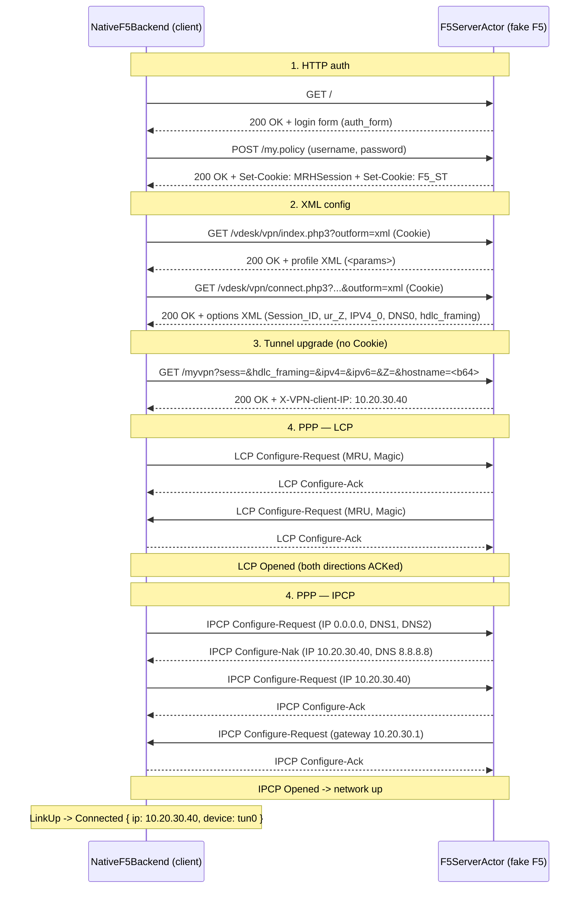
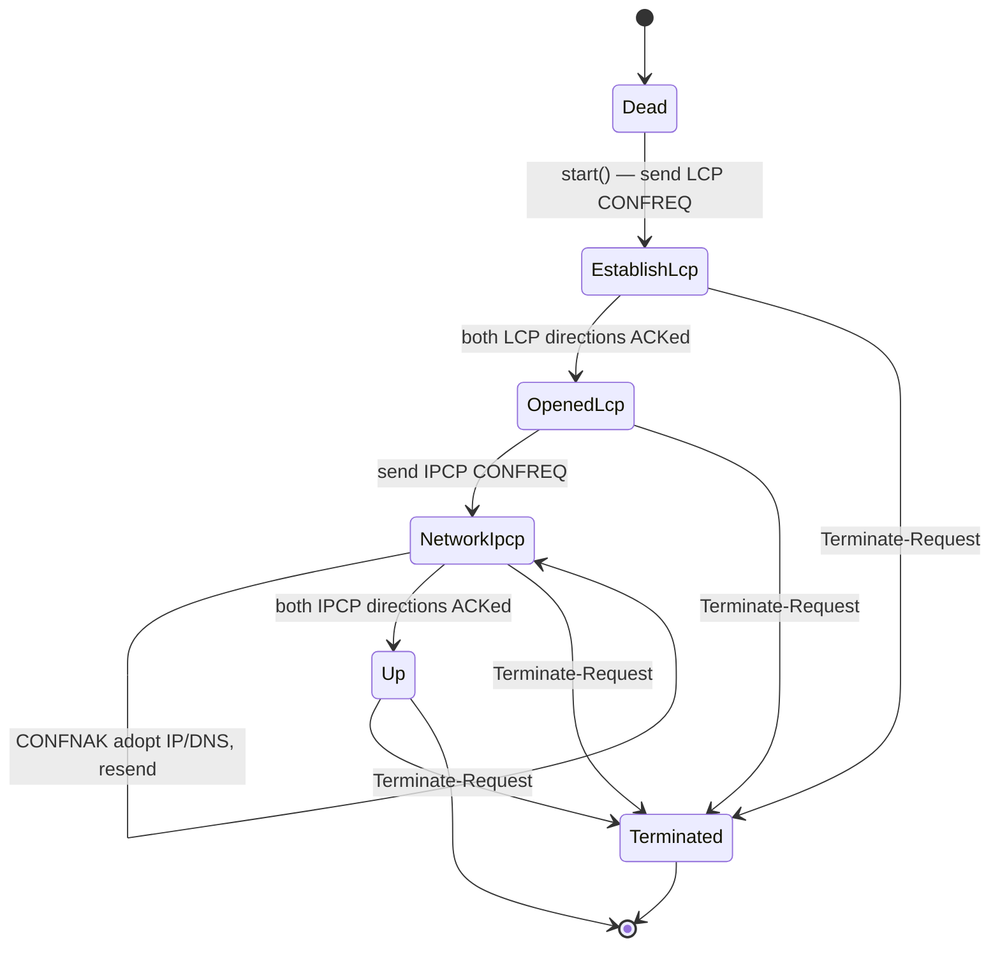

# Data Model: Native F5 VPN Backend

**Feature**: 006-native-f5-backend
**Date**: 2026-06-21
**Phase**: 1 - Design

## Overview

The native F5 backend is a pure-Rust F5 BIG-IP SSL VPN client decomposed into independently testable layers, each validated by the test actors framework (spec 005) as ground truth. F5 is **PPP-over-HTTPS**, so the data model is layered: a framing codec at the bottom, a PPP control engine above it, HTTP auth + XML config alongside, and the [`NativeF5Backend`] orchestrator on top — all I/O behind the [`Transport`] / [`TunDevice`] seams. Every type below corresponds to code under `akon-core/src/vpn/f5/` (production) or `akon-core/src/vpn/testkit/` (test-only).

All entities are deterministic and seam-isolated: no type here requires a real network, a real TLS endpoint, or root to exercise.

## Key Entities

### 1. F5Error (`f5/mod.rs`)

The single error type for the native F5 layers. Each variant maps to a specific failure mode along the handshake, and the backend maps it to a terminal `LifecycleEvent::Failed { kind, .. }`.

```text
F5Error =
  | BadEncapMagic(u16)                       // F5 encap magic != 0xf500
  | TruncatedFrame { needed, have }          // frame shorter than declared
  | HdlcFcsInvalid                           // HDLC FCS16 check failed
  | MalformedPpp(String)                     // PPP control packet unparseable
  | AuthFailed(String)                       // missing MRHSession/F5_ST
  | InvalidConfig(String)                    // options/profile XML missing fields
  | TunnelUpgradeRejected(u16)               // /myvpn returned non-200/201
  | MalformedHttp(String)                    // malformed HTTP response / I/O
```

`#[derive(Debug, thiserror::Error, PartialEq, Eq)]` — comparable so tests can assert exact variants.

### 2. Framing layer (`f5/framing.rs`) — pure

The wire codec for the two F5 PPP encapsulations. No state; just functions and constants.

| Item | Shape | Purpose |
|------|-------|---------|
| `F5_ENCAP_MAGIC` | `u16 = 0xf500` | F5 non-HDLC pre-PPP magic (big-endian). |
| `F5_ENCAP_LEN` | `usize = 4` | Length of the `magic(2) + len(2)` header. |
| `HDLC_FLAG` / `HDLC_ESCAPE` / `HDLC_XOR` | `u8` | RFC1662 `0x7e` / `0x7d` / `0x20`. |
| `PPPINITFCS16` / `PPPGOODFCS16` | `u16` | `0xffff` / `0xf0b8` FCS constants. |
| `ASYNCMAP_LCP` | `u32 = 0xffff_ffff` | Escape every control char `< 0x20`. |
| `fcs16(data) -> u16` | fn | Running RFC1662 FCS16 over `data` (init `0xffff`, reflected poly `0x8408`). |
| `f5_encap(ppp) -> Vec<u8>` | fn | Encode `0xf500 \| len16 \| payload`. |
| `f5_decap(buf) -> Result<Vec<Vec<u8>>, F5Error>` | fn | Decode zero or more concatenated F5 frames in order. |
| `hdlc_frame(payload, asyncmap) -> Vec<u8>` | fn | HDLC-frame: FCS16, escape, wrap in `0x7e` flags. |
| `hdlc_deframe(frame) -> Result<Vec<u8>, F5Error>` | fn | Strip flags, unescape, verify FCS16, drop trailing FCS. |

**F5 non-HDLC frame** on the wire:

```text
F5 00 <len_hi> <len_lo> <ppp payload ...>   (repeatable; next frame at 4 + len)
```

### 3. PPP layer (`f5/ppp.rs`) — pure

The PPP/LCP/IPCP build, parse, and negotiation logic.

**`NcpOption`** — a single TLV option inside an NCP control packet.

```text
NcpOption { tag: u8, data: Vec<u8> }   // value is `len - 2` bytes
NcpOption::new(tag, data)
```

**`NcpPacket`** — a parsed NCP (LCP/IPCP/IP6CP) control packet.

```text
NcpPacket { proto: u16, code: u8, id: u8, options: Vec<NcpOption> }
NcpPacket::option(tag) -> Option<&NcpOption>
```

On-the-wire shape (send side always emits the full prefix; parse side tolerates omissions):

```text
[FF 03]?  proto(1-2)  code(1) id(1) length(2 be)  <TLV options...>
```

**Constructors / codec**:

| Function | Purpose |
|----------|---------|
| `build_ncp_frame(&NcpPacket) -> Vec<u8>` | Full `FF 03` + 2-byte proto + NCP body (no PFC/ACFC on send). |
| `parse_ppp_frame(&[u8]) -> Result<NcpPacket, F5Error>` | Tolerant parse (optional `FF 03`, 1- or 2-byte proto). |
| `lcp_config_request(id, magic, mru)` | LCP CONFREQ offering MRU + Magic-Number. |
| `ipcp_config_request(id, requested_ip)` | IPCP CONFREQ requesting IP + soliciting DNS1/DNS2. |
| `lcp_echo_reply(id, magic, data)` | LCP Echo-Reply (DPD) carrying magic + echoed data. |
| `lcp_terminate_request(id)` | LCP Terminate-Request (no options). |

Protocol constants: `PPP_LCP=0xc021`, `PPP_IPCP=0x8021`, `PPP_IP6CP=0x8057`, `PPP_IP=0x21`, `PPP_IP6=0x57`; NCP codes `CONFREQ=1 … DISCREQ=11`; LCP tags (`LCP_MRU`, `LCP_ASYNCMAP`, `LCP_MAGIC`, …); IPCP tags (`IPCP_IPADDR=3`, `IPCP_DNS1=129`, `IPCP_DNS2=131`, …).

**`PppNegotiator`** — the deterministic negotiation state machine.

```text
PppNegotiator::new()                      // -> phase Dead
  .start() -> Vec<Vec<u8>>                // Dead -> EstablishLcp; emits LCP CONFREQ
  .on_frame(&[u8]) -> Result<Vec<Vec<u8>>, F5Error>   // feed inbound; get replies
  .phase() -> PppPhase
  .negotiated_ipv4() -> Option<[u8; 4]>
  .dns_servers() -> Vec<[u8; 4]>
```

It ACKs the peer's LCP/IPCP CONFREQ, adopts the IPv4 address + DNS offered in an IPCP CONFNAK, resends its IPCP request with the adopted IP, and declares the network up once both directions of IPCP are ACKed. Modelled on openconnect's `handle_state_transition`, simplified for a lossless TLS transport (no retransmit timers). Unknown protocols are ignored (empty output, no error). An LCP Echo-Request yields an Echo-Reply (DPD); a Terminate-Request yields a Terminate-Ack and moves to `Terminated`.

**`PppPhase`** — the negotiation phase (see [PPP State Machine](#ppp-state-machine)):

```text
PppPhase = Dead | EstablishLcp | OpenedLcp | NetworkIpcp | Up | Terminated
```

### 4. Auth layer (`f5/auth.rs`) — pure

F5 cookie/form success logic.

**`F5CookieJar`** — accumulates `Set-Cookie` values and reports auth success.

```text
F5CookieJar::new()
  .ingest_set_cookie(&str)         // store/overwrite; empty value deletes
  .get(name) -> Option<&str>
  .is_authenticated() -> bool      // true iff MRHSession AND F5_ST present
  .cookie_header() -> Option<String>   // "MRHSession=..; F5_ST=.." or None
```

Auth success is the **combination** of both `MRHSession` and `F5_ST` (per openconnect `check_cookie_success`). `MRHSession` alone is insufficient; it is often re-set repeatedly before auth completes.

Free functions:
- `build_login_body(username, password) -> String` — strict urlencoded `username=..&password=..` (unreserved literal, everything else `%XX`, space as `%20`).
- `parse_f5_st(value) -> Option<(i64, i64)>` — extract `(start, dur)` from the `z`-separated `F5_ST` record.
- `extract_cookie_pair(header, name) -> Option<String>` — value of the leading `name=value` pair.

Constants: `COOKIE_MRHSESSION = "MRHSession"`, `COOKIE_F5_ST = "F5_ST"`.

### 5. Config layer (`f5/config.rs`) — pure

Flat-XML parsing of the F5 profile and options documents, via a tiny dependency-free tolerant scanner (no XML crate).

**`F5Options`** — the per-tunnel settings parsed from the options XML.

```text
F5Options {
  session_id: Option<String>,   // Session_ID -> /myvpn sess=
  ur_z:       Option<String>,   // ur_Z       -> /myvpn Z=
  ipv4: bool, ipv6: bool,       // IPV4_0 / IPV6_0
  hdlc_framing: bool,           // hdlc_framing
  idle_timeout: Option<u32>,    // idle_session_timeout
  dtls: bool, dtls_port: Option<u16>,
  dns: Vec<String>,             // DNS0..  (document order)
  domains: Vec<String>,         // DNSSuffix0..
  routes: Vec<String>,          // LAN0..   (whitespace-split into CIDRs)
  default_gateway: bool,        // UseDefaultGateway0
}
```

Free functions:
- `parse_profile(xml) -> Result<String, F5Error>` — first `<params>` text inside a `<favorites type="VPN">`.
- `parse_options(xml) -> Result<F5Options, F5Error>` — requires `ur_Z` **and** `Session_ID` **and** at least one of `IPV4_0`/`IPV6_0`, else `InvalidConfig` (mirrors openconnect's failure check). Booleans accept int (`1`/`0`/`42`) or `yes`/`on`/`no`/`off`.

### 6. Transport / TunDevice seams (`vpn/transport.rs`)

The I/O boundary that lets every layer above be validated offline.

**`Transport`** (async trait) — a bidirectional, ordered, reliable byte stream.

```text
Transport (async, Send):
  send(&[u8]) -> io::Result<()>           // write all bytes
  recv(&mut [u8]) -> io::Result<usize>    // Ok(0) == peer closed (EOF)
  close() -> io::Result<()>               // idempotent (default Ok)
```

Production: TLS-over-TCP. Tests: `MemoryTransport`.

**`TunDevice`** (async trait) — the OS tunnel interface that ingests/produces raw IP packets.

```text
TunDevice (async, Send):
  configure(&TunConfig) -> io::Result<()>
  write_packet(&[u8]) -> io::Result<()>   // inbound -> OS
  read_packet(&mut [u8]) -> io::Result<usize>  // OS -> tunnel; Ok(0) closed
```

**`TunConfig`** — negotiated interface config (`ipv4`, `mtu`, `dns`, `domains`, `routes`). Production needs `CAP_NET_ADMIN`; tests use a recording fake, so orchestration is validated without root.

### 7. NativeF5Backend (`f5/backend.rs`)

The orchestrator implementing the durable [`VpnBackend`] boundary from spec 005.

```text
NativeF5Backend::with_transport(Box<dyn Transport>, host) -> Self

impl VpnBackend:
  connect(Credentials) -> Result<UnboundedReceiver<LifecycleEvent>, BackendError>
  disconnect() -> Result<(), BackendError>     // idempotent
  is_alive() -> bool
  handle() -> Option<ConnectionHandle>          // opaque id (seq from 5000)
```

`connect` spawns a task that emits `Connecting`, then runs the whole handshake under a 10-second timeout via the internal `run_session`:

1. **Auth** — `GET /` (login form) → `POST /my.policy` credentials → collect `Set-Cookie` → require both cookies → emit `Authenticating`, then `SessionEstablished`.
2. **Config** — `GET index.php3` (profile XML, with Cookie) → `parse_profile`; `GET connect.php3` (options XML) → `parse_options`.
3. **Tunnel upgrade** — `GET /myvpn?sess=&hdlc_framing=&ipv4=&ipv6=&Z=&hostname=<base64>` **with no Cookie** → require 200/201 → read `X-VPN-client-IP`.
4. **PPP** — `run_ppp` drives LCP then IPCP to `PppPhase::Up` over F5-encapsulated frames (5-second inner deadline) → emit `LinkUp`, then `Connected { ip, device: "tun0" }` and mark the connection alive with a handle.

Any `F5Error` maps to `Failed { kind, detail }` (`AuthFailed → Authentication`, `InvalidConfig → Backend`, framing/PPP/HTTP/tunnel → `Network`); a timeout maps to `Failed { Network, "handshake timed out" }`. No path can reach `Connected` after a failure.

### 8. Testkit: MemoryTransport (`testkit/transport.rs`) — test-only

In-memory full-duplex `Transport`.

```text
MemoryTransport::pair() -> (MemoryTransport, MemoryTransport)
```

Bytes written to one endpoint are readable from the other. **Dropping** (or `close`-ing) an endpoint flips an atomic `closed` flag and wakes waiters, so a blocked `recv` on the peer observes EOF (`Ok(0)`) instead of hanging — this is what makes the actor loops terminate deterministically with no real I/O.

### 9. Testkit: F5ServerActor / F5ServerScript (`testkit/f5_server_actor.rs`) — test-only

The fake F5 BIG-IP server actor — the **ground-truth oracle**. It speaks the real F5 wire protocol over a `MemoryTransport`, using the *real* `framing` and `ppp` code so tests exercise the genuine codec (not a re-implementation).

**`F5ServerScript`** — controls behavior for a session.

```text
F5ServerScript {
  accept_auth: bool,       // sets both cookies, or rejects
  tunnel_status: u16,      // /myvpn status (200/201 = success)
  assigned_ip: [u8; 4],    // default 10.20.30.40
  dns: [u8; 4],            // default 8.8.8.8
  hdlc: bool,              // advertise HDLC in options XML
}
F5ServerScript::default()           // successful session
F5ServerScript::auth_failure()      // accept_auth = false
F5ServerScript::tunnel_rejected(s)  // tunnel_status = s
```

**`F5ServerActor`** — `new(script)` and `run(&mut transport)`:
- Serves the login form on `GET /`, sets `MRHSession` + `F5_ST` on credential `POST` (when `accept_auth`), serves profile/options XML, answers `GET /myvpn` with `tunnel_status` + `X-VPN-client-IP`.
- Then becomes the PPP peer: ACKs the client's LCP CONFREQ and sends its own; NAKs the first IPCP CONFREQ with `assigned_ip` + `dns`, ACKs the second, and sends its own IPCP CONFREQ (gateway `.1`) so both directions complete → network up.
- Returns when the exchange completes or the transport closes (EOF).

## Protocol Sequence

The full F5 handshake between the backend (client) and the fake F5 server actor over the in-memory transport:



## PPP State Machine

The `PppPhase` lifecycle driven by `PppNegotiator`:



`OpenedLcp` is transient: `maybe_open_lcp` immediately sends the IPCP CONFREQ and moves to `NetworkIpcp`. A Terminate-Request at any phase yields a Terminate-Ack and `Terminated`. An LCP Echo-Request (DPD) produces an Echo-Reply with **no** phase change.

## Error Handling

| Condition | F5Error | Lifecycle outcome |
|-----------|---------|-------------------|
| Login POST yields no `F5_ST` (or no `MRHSession`) | `AuthFailed` | `Failed { Authentication }`; never `Connected` |
| Options XML missing `ur_Z` / `Session_ID` / any IP family | `InvalidConfig` | `Failed { Backend }` |
| `/myvpn` returns non-200/201 (e.g. 403) | `TunnelUpgradeRejected(403)` | `Failed { Network }`; never `Connected` |
| Encap magic ≠ `0xf500` | `BadEncapMagic` | frame error → `Failed { Network }` (no crash) |
| Truncated F5 frame | `TruncatedFrame` | `Failed { Network }` |
| HDLC FCS mismatch | `HdlcFcsInvalid` | `Failed { Network }` |
| Unparseable PPP control packet | `MalformedPpp` | `Failed { Network }` |
| Transport closes mid-PPP | `MalformedPpp("transport closed during PPP")` | `Failed { Network }` |
| IPCP never converges within 5s, or whole handshake exceeds 10s | `MalformedPpp("…timed out")` / outer timeout | `Failed { Network, "…timed out" }` — deterministic, no hang |
| `disconnect()` on a torn-down connection | — | no-op success; `is_alive() == false` |

## Assumptions

- The TLS transport is lossless and ordered, so PPP needs no retransmit timers (a simplification vs. openconnect's UDP-capable engine).
- The fake F5 server uses the **real** `framing`/`ppp` modules, so a passing equivalence test proves the genuine codec — not a mirror implementation — interoperates.
- Logical time bounds (5s PPP, 10s handshake, 8s test collect) keep all tests fast and hang-free.
- The native backend is additive: production defaults are unchanged in this feature (FR-013).

## Summary

The model layers a pure framing codec (`f5_encap`/`f5_decap`/`hdlc_frame`/`hdlc_deframe`/`fcs16`) under a pure PPP engine (`NcpPacket`/`NcpOption`/`PppNegotiator`/`PppPhase`) and pure auth/config logic (`F5CookieJar`/`F5Options`), all behind the `Transport`/`TunDevice` seams. `NativeF5Backend` orchestrates them into the durable `VpnBackend` contract, while the testkit's `MemoryTransport` + `F5ServerActor`/`F5ServerScript` act as a wire-accurate oracle — letting the entire F5 protocol be exercised and proven equivalent to ground truth with no server, no root, and no network.
